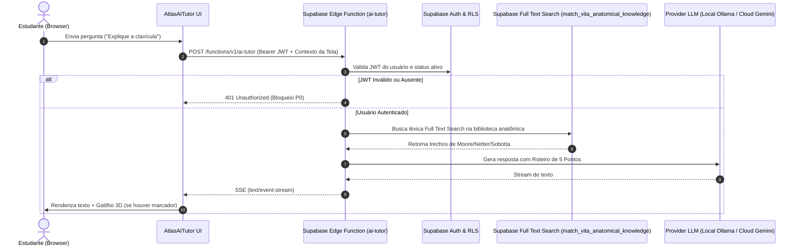
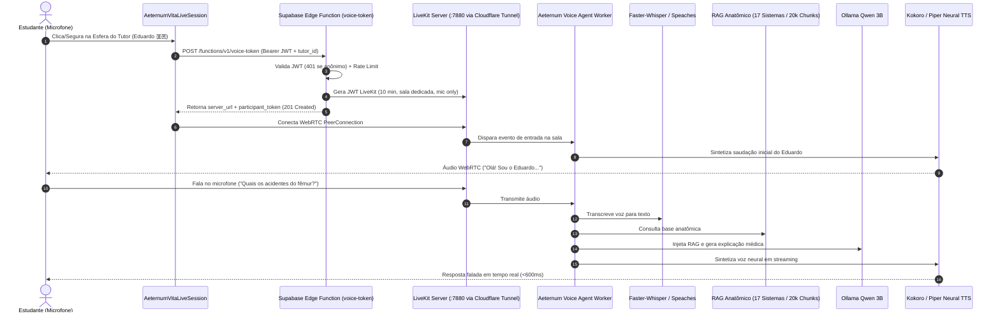

# 🏛️ AETERNUM_AI_CURRENT_ARCHITECTURE.md
**Documento de Arquitetura, Inventário e Baseline Operacional (Fase 0)**
**Data do Mapeamento:** 24 de Agosto de 2026  
**Status do Sistema:** Operação Híbrida (Transição para Sovereign Local-First)

---

## 1. Visão Geral da Arquitetura Atual

O ecossistema **Aeternum Atlas** divide-se em três macro-camadas:

1. **Frontend & Interface (Vercel / `www.aeternumatlas.com`):**
   * Aplicação SPA em React 18 + Vite com suporte ao sistema de design *Aeternum 26.1 Liquid Glass*.
   * Dois pontos de interação com IA:
     * **Atlas AI Tutor (Texto / 3D Viewer / Flashcards / Mapas Mentais):** Comunicação via HTTP Server-Sent Events (SSE).
     * **Aeternum Vita Voice (Tutores Multi-idioma em Áudio):** Comunicação WebRTC em tempo real via LiveKit.

2. **Backend & Segurança (Supabase Cloud `aeternum-atlas-saas` - `hyivyrietgjdazgizafp`):**
   * **Auth & RLS:** Gestão de usuários, instituições e papéis acadêmicos (estudantes, professores, administradores).
   * **Edge Functions:**
     * `ai-tutor`: Processamento de linguagem natural, socrática e clínica.
     * `voice-token`: Emissão de credenciais e salas WebRTC LiveKit.
   * **Banco de Dados & Vetores:**
     * `vita_anatomical_knowledge`: **20.302 chunks** anatômicos de 12 livros canônicos indexados com vetores (`Full Text Search (FTS)`).
     * `ai_conversations` & `ai_messages`: Histórico de mensagens do chat textual.
     * `ai_audit_events`: Auditoria de consumo e latência de IA.
     * `vita_tutor_memory`: Memória pedagógica individual do estudante.

3. **Motor de IA & Processamento (HP Victus Local + Nuvem):**
   * **Stack Local Docker:**
     * `livekit-server` (:7880) — Servidor WebRTC Community livre.
     * `ollama` (:11434) — Motor LLM local com `qwen2.5:3b`.
     * `speaches` (:8000) — Faster-Whisper (STT) + Kokoro/Piper (TTS).
     * `aeternum-vita-agent` — Worker de orquestração conversacional.
   * **Ponte de Rede:** Cloudflare Tunnel (`cloudflared`).

---

## 2. Mapeamento dos Fluxos do Sistema

### 💬 A. Fluxo de CHAT (Atlas AI Tutor)

---

### 🎙️ B. Fluxo de VOICE (Aeternum Vita)

---

### 📚 C. Fluxo de RAG (Conhecimento Anatômico)
* **Tabela Principal:** `vita_anatomical_knowledge` (Supabase Cloud).
* **Volume Indexado:** 20.302 chunks (12 livros canônicos: Moore, Netter, Latarjet Tomos 1 e 2, Prometheus, Snell, McMinn).
* **Camada Local em Memória:** 17 tópicos enciclopédicos estruturados em 4 idiomas (PT, ES, EN, DE) no arquivo `anatomical-knowledge.ts` da Vita.
* **Mecanismo de Busca:** Híbrido (busca vetorial com Full Text Search (to_tsvector, websearch_to_tsquery, ts_rank_cd) — Planejado: Híbrido Vetorial + Reranking de termos e acidentes ósseos).

---

### 🧠 D. Fluxo de MEMORY (Memória do Estudante)
* **Tabelas de Registro:**
  * `ai_conversations`: Metadados da sessão, rota de origem e tópico central.
  * `ai_messages`: Histórico de mensagens categorizado por `role: user` e `role: assistant`.
  * `vita_tutor_memory`: Nível de domínio do aluno por assunto, erros recorrentes e estilo preferido de sabatina.
  * `study_agenda`: Atividades agendadas e revisões espaçadas.
* **Princípio de Isolamento:** Memória pedagógica do aluno é 100% segregada da base enciclopédica do RAG.

---

### 🔒 E. Fluxo de AUTH & Segurança
* **Autenticação:** Supabase GoTrue (JWT emitido no login do aluno).
* **Políticas RLS:** Cada estudante só tem permissão de ler e gravar as suas próprias mensagens e sessões.
* **Gateways:** `voice-token` e `ai-tutor` validam o JWT no header `Authorization: Bearer <token>`. Requisições sem token válido são rejeitadas imediatamente com código `401 Unauthorized`.

---

## 3. Inventário de Providers & Código

| Componente | Estado Atual | Papel na Arquitetura Soberana |
| :--- | :--- | :--- |
| **LiveKit Community** | 🟢 Ativo (Local Docker :7880) | Camada de transporte WebRTC em tempo real |
| **Ollama (Qwen 2.5:3b)** | 🟢 Ativo (Local Docker :11434) | Provider LLM Local Primário |
| **Google Gemini (2.0-Flash)** | 🟡 Ativo (Supabase Edge) | Provider LLM Cloud Contingência |
| **Faster-Whisper** | 🟢 Ativo (Local Speaches :8000) | Provider STT Local Primário |
| **Deepgram (Nova-3)** | 🟡 Código Desacoplado | Provider STT Cloud Contingência |
| **Kokoro / Piper** | 🟢 Ativo (Local Speaches :8000) | Provider TTS Local Primário |
| **Cartesia (Sonic-3)** | 🟡 Código Desacoplado | Provider TTS Cloud Contingência |
| **Supabase Full Text Search (FTS)** | 🟢 Ativo (20.302 Chunks) | Source of Truth para RAG Anatômico |
| **Cloudflare Tunnel** | 🟢 Ativo (`cloudflared`) | Ponte segura TLS para o LiveKit Local |

---

## 4. Baseline de Testes & Qualidade

* **Suíte Monorepo:** 64/64 testes automatizados aprovados (Vitest).
* **Latência Média de Conexão WebRTC:** ~512ms.
* **Auditoria de Secrets:** Zero credenciais privadas expostas no bundle do cliente (`VITE_*`).
