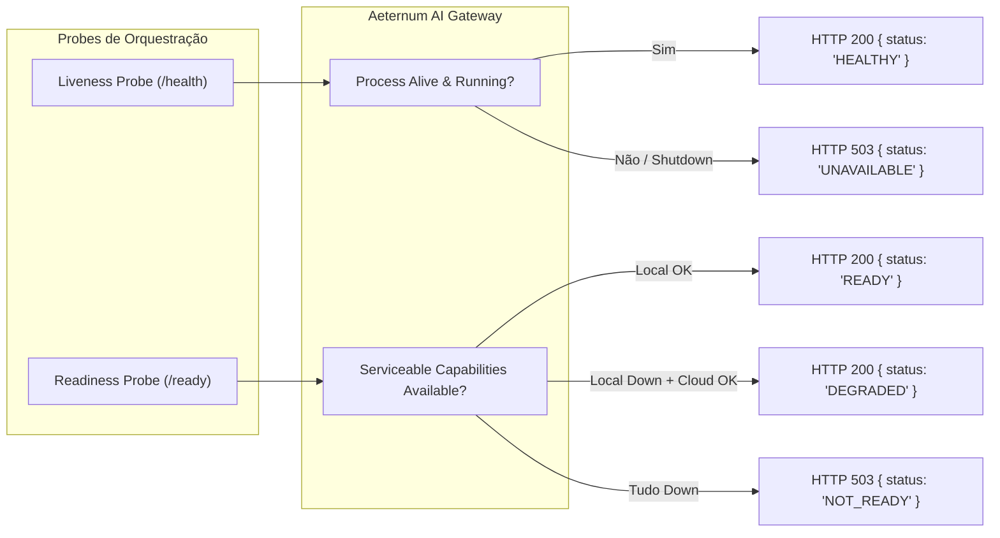

# AETERNUM ATLAS & VITA — FASE 3B.4B.1
## PRONTIDÃO DE RUNTIME DO AI GATEWAY PARA PRÉ-PRODUÇÃO (RUNTIME READINESS)

**Documento:** `PHASE_3B_4B_1_PRODUCTION_RUNTIME_READINESS.md`  
**Status:** `IMPLEMENTED / PENDING CHATGPT AUDIT`  
**Data:** 2026-08-30  
**Branch Base:** `antigravity/phase-3b-atlas-tutor-gateway`  
**Baseline Imutável Verificado:** `c313e5c23a484638c545e8a35ea984fe26ef4542` (Phase 3B.4A.1 VERIFIED)

---

## 1. SUMÁRIO EXECUTIVO

A **Fase 3B.4B.1** implementou o endurecimento do runtime do `AeternumAIGateway` para permitir sua execução segura, resiliente e auditável fora do ambiente de desenvolvimento local, preparando o artefato de execução para futuros testes de homologação e pré-produção.

### Principais Capacidades Entregues:
1. **Rotação Dual-Token Zero-Downtime:** Suporte a token primário (`PRIMARY_SERVICE_TOKEN`) e token secundário opcional (`SECONDARY_SERVICE_TOKEN`) com comparação em tempo constante (`crypto.timingSafeEqual`).
2. **Validação Estrita de Configuração na Inicialização:** Bloqueio de inicialização para bindings públicos (`0.0.0.0`) com modos inseguros (`INTERNAL_DEV` ou `DISABLED`), validação de timeouts (`providerTimeoutMs < gatewayRequestTimeoutMs`) e modo `SERVICE_TOKEN` fail-closed se nenhum token for fornecido.
3. **Separação Semântica de Liveness (`/health`) e Readiness (`/ready`):**
   - `GET /health`: Verifica liveness do processo.
   - `GET /ready`: Avalia a prontidão das dependências de inferência, retornando estados sanitizados (`READY` / `DEGRADED` / `NOT_READY`) sem vazar credenciais ou URLs internas.
4. **Encerramento Gracioso (Graceful Shutdown):** Tratamento de `SIGTERM` e `SIGINT`, rejeição imediata de novas requisições com HTTP 503 e conclusão controlada de requisições em trânsito dentro de um deadline configurável (`shutdownTimeoutMs`).
5. **Controle de Concorrência e Backpressure (`maxConcurrentRequests`):** Proteção bounded que rejeita requisições em excesso com HTTP 429 (`RATE_LIMITED`), impedindo saturação e estouro de memória.
6. **Segurança Rigorosa de Logs:** Auditoria de telemetria assegurando zero registro de tokens, chaves de API, JWTs, prompts brutos ou áudio.
7. **Empacotamento de Contêiner de Produção:** Criação do `apps/gateway/Dockerfile` com imagem base Node 24 slim, usuário não-root (`USER node`), multi-stage build e healthcheck integrado.

---

## 2. DETALHAMENTO DAS ESPECIFICAÇÕES IMPLEMENTADAS

### 2.1. Rotação Dual-Token (`SERVICE_TOKEN`)
- **Regras de Autenticação:**
  - Token recebido igual ao Primário $\rightarrow$ **HTTP 200 (PASS)**
  - Token recebido igual ao Secundário $\rightarrow$ **HTTP 200 (PASS)**
  - Token ausente $\rightarrow$ **HTTP 401 Unauthorized**
  - Token divergente $\rightarrow$ **HTTP 401 Unauthorized**
  - Sem nenhum token configurado $\rightarrow$ Inicialização bloqueada (Fail-Closed).
- **Segurança Criptográfica:** Ambas as comparações utilizam buffers de mesmo comprimento e `crypto.timingSafeEqual` para imunidade contra ataques de temporização (timing attacks).

### 2.2. Separação Semântica de Saúde & Prontidão

### 2.3. Resumo da Matriz de Prontidão (`/ready`)
| Cenário | Local LLM | Cloud LLM (Fallback) | Status HTTP | Status de Prontidão |
| :--- | :--- | :--- | :--- | :--- |
| **Normal / Saudável** | HEALTHY | HEALTHY / Disabled | `200 OK` | `"READY"` |
| **Nó Local Indisponível** | UNAVAILABLE | HEALTHY (Configured) | `200 OK` | `"DEGRADED"` *(Pode receber tráfego via Cloud)* |
| **Falha Total de Provedores**| UNAVAILABLE | UNAVAILABLE / Disabled | `503 Service Unavailable` | `"NOT_READY"` |

---

## 3. REGRESSÃO E TESTES DE PRONTIDÃO

A suíte determinística `gateway_production_readiness_3b4b1.test.ts` cobre:
1. Autenticação com Token Primário e Secundário.
2. Rejeição de tokens inválidos e ausentes.
3. Validação de configuração no construtor.
4. Liveness (`/health`) vs. Readiness (`/ready`).
5. Proteção de concorrência com rejeição HTTP 429.
6. Encerramento gracioso com atendimento de requisição em trânsito.

**Resultado da Suíte Monorepo:**
- `gateway_production_readiness_3b4b1.test.ts` $\rightarrow$ **5/5 PASS**
- Suíte completa (`src/providers`, `src/gateway`, `apps/agent`) $\rightarrow$ **308/308 PASS** (30 skipped cloud live opt-in)
- Compilação estrita TypeScript (`tsconfig.json`, `apps/gateway`, `apps/agent`) $\rightarrow$ **0 erros**

---

## 4. MATRIZ DE INVARIANTES DE GOVERNANÇA

| Invariante | Valor | Status |
| :--- | :--- | :--- |
| Alterações em Produção Supabase | 0 | **CONGELADO** |
| Alterações em Produção Vercel | 0 | **CONGELADO** |
| Alterações Visuais no Frontend | 0 | **CONGELADO** |
| Alterações em CSS | 0 | **CONGELADO** |
| Infraestrutura Provisionada | 0 | **CONGELADO** |
| Chamadas Diretas de Geração ao Gemini no Edge | 0 | **VERIFICADO** |
| Exceção Temporária de Embedding RAG | 1 | **PRESERVADO** |
| Cutover em Produção | Bloqueado | **BLOQUEADO** |
| Fase 3C | Não Iniciada | **BLOQUEADA** |

---

**STATUS:**  
`PHASE 3B.4B.1 IMPLEMENTED / PENDING CHATGPT AUDIT`
