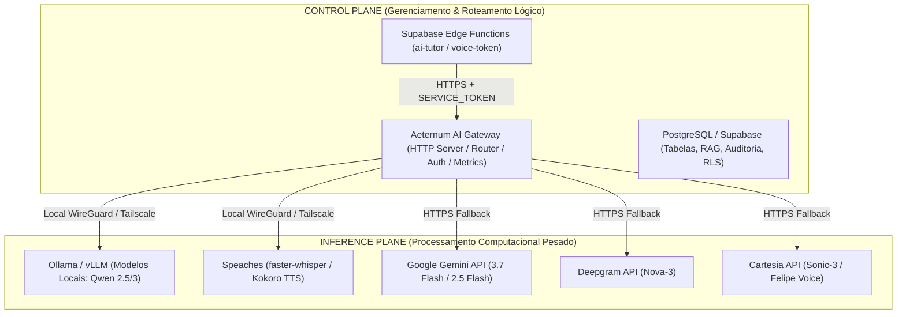
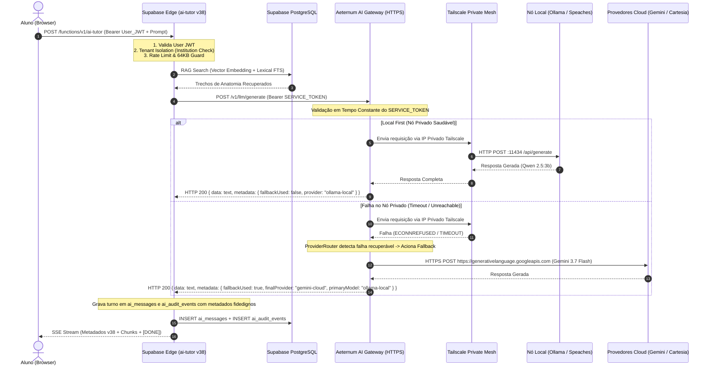

# AETERNUM ATLAS & VITA — FASE 3B.4
## ARQUITETURA DE PRODUÇÃO, CONECTIVIDADE E ALCANCE DO AI GATEWAY

**Documento:** `PHASE_3B_4_PRODUCTION_GATEWAY_ARCHITECTURE.md`  
**Status:** `PROPOSTA ARQUITETURAL / AGUARDANDO AUDITORIA CHATGPT (3B.4A)`  
**Data:** 2026-08-29  
**Branch Base:** `antigravity/phase-3b-atlas-tutor-gateway`  
**Baseline Imutável Verificado:** `475c93e51590a216aba4851389d592934837c24a` (Phase 3B VERIFIED)

---

## 1. SUMÁRIO EXECUTIVO & CONTEXTO

Com a conclusão e verificação arquitetural da **Fase 3B** (`3B.1`, `3B.2`, `3B.3` e `3B_METADATA_PATCH`), os contratos de aplicação do `ai-tutor` no Supabase Edge e a camada de roteamento/autenticação `SERVICE_TOKEN` do `AeternumAIGateway` foram formalmente validados e testados (303/303 testes unitários e de integração verdes, 0 erros TypeScript).

Contudo, a topologia atual opera sob um invariante de desenvolvimento estrito:
$$\text{Binding Local: } 127.0.0.1:8081 \quad \Longrightarrow \quad \text{Inacessível publicamente pelo Supabase Edge em Produção}$$

Este documento estabelece o **design arquitetural de produção** para tornar o AI Gateway acessível de maneira segura, resiliente, auditável e com alta disponibilidade pelo Supabase Edge Functions, mantendo a filosofia **Local-First com Cloud Fallback** e garantindo que o hardware de desenvolvimento local (**HP Victus**) seja tratado estritamente como **Nó de Desenvolvimento / Piloto**, e não como infraestrutura de produção crítica exposta.

---

## 2. SEPARAÇÃO FUNDAMENTAL DE PLANOS E AMBIENTES



### 2.1. Control Plane vs. Inference Plane
1. **Control Plane (Plano de Controle):**
   - Responsável por autenticação de usuários, autorização multi-tenant, isolamento de instituições, validação de tokens JWT/Service, orquestração de chamadas RAG, persistência de turnos e auditoria.
   - Componentes: Supabase Edge Functions (`ai-tutor`, `voice-token`), Supabase PostgreSQL e o `AeternumAIGateway` (como orquestrador de tráfego HTTP/SSE).
2. **Inference Plane (Plano de Inferência):**
   - Responsável pela execução numérica de modelos de linguagem (LLM), reconhecimento de fala (STT) e síntese vocal (TTS).
   - Componentes: Motores locais de inferência (Ollama/vLLM, Speaches) e APIs gerenciadas de nuvem (Gemini, Deepgram, Cartesia).

### 2.2. Dev/Pilot Node vs. Production Infrastructure
- **HP Victus (Ambiente Atual):** Classificado estritamente como **Nó de Piloto Acadêmico / Desenvolvimento**. Suporta validações locais, pareamento com LiveKit local e testes controlados. Proibido de receber exposição direta de portas via NAT ou port forwarding residencial.
- **Produção Multi-Institucional:** Infraestrutura em nuvem/datacenter conteinerizada (ex: AWS ECS/Fargate, Fly.io, Hetzner GPU, ou Servidor Dedicado On-Premise Universitário) com terminação TLS gerenciada, DNS canônico corporativo, segredos injetados por KMS/Vault e monitoramento 24/7.

---

## 3. RESPOSTAS DETALHADAS ÀS 14 QUESTÕES ARQUITETURAIS

### Q1. Onde deve rodar o AI Gateway de produção?
**Resposta:** O AI Gateway deve rodar como um serviço conteinerizado (Docker / Node 24 runtime) em um ambiente de nuvem de baixa latência e alta disponibilidade (ex: **Fly.io**, **AWS ECS/Fargate**, ou **GCP Cloud Run**) ou em um **Cluster Kubernetes Dedicado de Borda** próximo às Edge Functions do Supabase (região `sa-east-1` ou `us-east-1`).

### Q2. Como as Supabase Edge Functions o alcançarão com segurança?
**Resposta:** Exclusivamente via **HTTPS (TLS 1.3 obrigatório)** através de um domínio seguro canônico (ex: `https://gateway.aeternum.app` ou `https://ai-gateway.aeternumatlas.com.br`), com terminação TLS gerenciada (Cloudflare Enterprise / AWS ALB), com validação de certificados pública e proteção anti-DDoS.

### Q3. Como o Gateway autenticará as requisições do Supabase?
**Resposta:** Através do modo canônico **`SERVICE_TOKEN`** (implementado na Fase 3B.2):
- A Edge Function injeta o cabeçalho `Authorization: Bearer <AETERNUM_AI_GATEWAY_TOKEN>`.
- O Gateway valida o token em tempo constante com `crypto.timingSafeEqual` contra o segredo injetado nas variáveis de ambiente.
- Requisições sem token, com token incorreto ou contendo JWTs de usuário final são rejeitadas imediatamente com **HTTP 401 Unauthorized** (`provider_call_count = 0`).

### Q4. Onde deve rodar a inferência local de produção?
**Resposta:**
1. **Fase Piloto Universitário (1 instituição / laboratório):** Servidor local dedicado do laboratório (ou nó piloto autenticado) com GPU Nvidia RTX 4070Ti/4090/A4000.
2. **Fase Produção Multi-Institucional:** Instâncias de GPU Dedicada em nuvem privada (ex: RunPod Serverless/Dedicated, Lambda Labs, ou Instância AWS EC2 `g5.xlarge` com vLLM e Speaches conteinerizados).

### Q5. Como o Gateway alcançará os provedores locais/privados de LLM, STT e TTS?
**Resposta:** Através de uma **Malha VPN Privada Segura (Mesh Overlay Network)** utilizando **Tailscale** ou **WireGuard**:
- O Gateway e os nós de inferência pertencem à mesma rede virtual privada criptografada (ex: IP Tailscale `100.x.y.z`).
- O Gateway comunica-se com Ollama (`http://100.x.y.z:11434`) e Speaches (`http://100.x.y.z:8000`) através do túnel criptografado ponto-a-ponto com autenticação mTLS/PSK.
- **Invariante:** Nenhuma porta de inferência (11434, 8000) jamais é exposta à Internet pública.

### Q6. A filosofia Local-First pode ser mantida com segurança em produção?
**Resposta:** **Sim.** O `ProviderRouter` prioriza o nó de inferência privado da rede Tailscale/WireGuard. Se a latência ou o status de saúde do nó local estiver operacional, 100% da inferência é executada localmente com custo zero de tokens de terceiros. Se o nó local ficar offline ou sofrer timeout, o `ProviderRouter` aciona automaticamente o fallback de nuvem.

### Q7. Como opera o Cloud Fallback se o nó privado de inferência estiver indisponível?
**Resposta:** De forma transparente e sem intervenção humana:
1. O Gateway tenta a chamada primária ao nó privado.
2. Ao detectar falha recuperável (`ECONNREFUSED`, `ETIMEDOUT`, `PROVIDER_UNAVAILABLE`), o `ProviderRouter` captura o erro e despacha imediatamente a requisição para o provedor de nuvem correspondente (Gemini para LLM, Deepgram para STT, Cartesia para TTS).
3. O Gateway retorna a resposta com metadados fidedignos (`fallbackUsed: true`, `finalProvider: "gemini-cloud"`).
4. A Edge Function do Supabase recebe o retorno, persiste as métricas fidedignas e emite a resposta ao aluno sem interrupção de serviço.

### Q8. O que acontece se o próprio Gateway estiver indisponível?
**Resposta:** Princípio **Fail-Closed Gracioso**:
- A Edge Function `handleAiTutorRequest` intercepta o erro de rede (`CONNECTION_REFUSED` / `TIMEOUT`).
- Exclui qualquer mensagem órfã criada no início do turno para garantir integridade relacional.
- Retorna ao cliente **HTTP 503** com payload seguro:
  ```json
  {
    "error": "Tutor IA temporariamente indisponível. Tente novamente em instantes.",
    "code": "AI_GATEWAY_UNAVAILABLE"
  }
  ```
- Nenhum dado confidencial, traceback ou chave é vazado ao cliente.

### Q9. Como os segredos são provisionados e rotacionados?
**Resposta:**
- **Supabase Edge:** `AETERNUM_AI_GATEWAY_TOKEN` provisionado via `supabase secrets set` (criptografado em repouso pelo Supabase Vault).
- **AI Gateway:** Injetado via gerenciador de segredos em runtime (ex: Doppler, AWS Secrets Manager, ou variáveis encriptadas do Fly.io).
- **Rotação:** O Gateway suportará lista de tokens válidos transitórios durante janelas de rotação (token antigo + token novo) para rotação sem downtime.

### Q10. Como a arquitetura escala além do piloto HP Victus?
**Resposta:**
- **Gateway:** Stateless horizontalmente (`N` instâncias atrás de Load Balancer HTTPS).
- **Inference Nodes:** Pool de instâncias vLLM/Ollama com balanceamento de carga Round-Robin / Least-Connections gerenciado pelo Gateway.
- **Cloud Fallback:** Auto-elástico e com capacidade virtualmente ilimitada para picos de acesso.

### Q11. Quais componentes EXIGEM ingress público?
**Resposta:**
1. **Frontend Web (Vercel):** `https://aeternumatlas.com.br` (HTTPS :443 público).
2. **Supabase Edge API:** `https://<project-ref>.supabase.co/functions/v1/*` (HTTPS :443 público com auth JWT).
3. **AI Gateway HTTPS Endpoint:** `https://gateway.aeternum.app/v1/*` (HTTPS :443 público, restrito por validação de `SERVICE_TOKEN`).
4. **LiveKit Server (WebRTC):** `wss://livekit.aeternum.app` (Portas 443/7880 e faixa UDP 50000-50100 para mídia WebRTC).

### Q12. Quais componentes NUNCA devem ter ingress público?
**Resposta:**
1. **Ollama / vLLM API:** Porta `11434` (estritamente privada/VPN).
2. **Speaches STT/TTS API:** Porta `8000` (estritamente privada/VPN).
3. **Redis Session Store:** Porta `6379` (estritamente privada).
4. **PostgreSQL Database:** Porta `5432` direta (acessível apenas via pooler interno Supabase).
5. **LiveKit Internal RPC / Portas administrativas:** Apenas tráfego autenticado.

### Q13. Qual a infraestrutura necessária para o piloto universitário inicial?
**Resposta:**
- 1 Servidor/Desktop Local (GPU Nvidia RTX $\ge 8\text{GB}$ VRAM, 32GB RAM, Ubuntu/Windows com Docker).
- Tailscale Daemon instalado no Nó Local e no Gateway.
- 1 Instância Gateway em nuvem (Fly.io shared-cpu-1x / 1GB RAM) ou Cloudflare Tunnel apontando para o Gateway local.
- Supabase Edge Functions configuradas com a URL HTTPS segura.

### Q14. Qual a infraestrutura necessária para produção multi-institucional?
**Resposta:**
- 2x Instâncias AI Gateway em regiões redundantes.
- 1x Cluster de Inferência Privado Dedicado (ex: 2x nós GPU Cloud com vLLM e autoscaling).
- Cloud Fallback ativo para 100% de tolerância a falhas.
- Monitoramento centralizado (Datadog / Prometheus + Grafana / Sentry).

---

## 4. FLUXO DE REDE, CONFIANÇA E AUTENTICAÇÃO



---

## 5. COMPARATIVO DE OPÇÕES ARQUITETURAIS AVALIADAS

| Critério | Opção 1: Cloudflare Tunnel (Edge $\rightarrow$ Local Gateway) | Opção 2: Gateway em Nuvem + Tailscale Mesh (Recomendada) | Opção 3: Port Forwarding / IP Público Residencial |
| :--- | :--- | :--- | :--- |
| **Segurança** | Alta (Zero portas abertas no roteador) | **Máxima (Isolamento total de planos)** | Crítica / Inaceitável (Exposição direta) |
| **Resiliência do Gateway** | Baixa (Se máquina local desliga, Gateway cai) | **Alta (Gateway em nuvem sempre atende e faz fallback)** | Nula |
| **Latência Edge $\rightarrow$ Gateway** | Média (Túnel Cloudflare) | **Mínima (< 20ms Edge $\rightarrow$ Cloud Gateway)** | Alta / Instável |
| **Garantia de Fallback** | Falha se o host local estiver desligado | **100% Garantido (Mesmo com nó local offline)** | Falha se o host local estiver desligado |
| **Complexidade Operacional** | Baixa | **Moderada** | Baixa (porém insegura) |
| **Classificação** | *Viável para Piloto Individual* | **ARQUITETURA CANÔNICA DE PRODUÇÃO** | **REJEITADA SUMARIAMENTE** |

### 5.1. Justificativa da Opção Recomendada (Opção 2):
A **Opção 2 (AI Gateway em Nuvem conteinerizado com conexão via Tailscale Mesh ao nó local)** é a única que preserva integralmente o **Princípio da Resiliência Total**:
- Se o laboratório universitário sofrer falta de energia ou queda de internet, o Gateway em nuvem permanece 100% ativo.
- O `ProviderRouter` detecta a queda do nó local e redireciona todo o tráfego de inferência para o Cloud Fallback (Gemini / Cartesia) sem nenhuma queda percebida pelos alunos.
- Nenhum IP de infraestrutura on-premise é exposto ao público.

---

## 6. MATRIZ DE RISCOS & MITIGAÇÕES

| Risco Identificado | Nível | Mitigação Arquitetural |
| :--- | :--- | :--- |
| **Vazamento do SERVICE_TOKEN** | Alto | Segredo injetado estritamente via KMS/Vault; Gateway rejeita requisições sem SSL; rotação suportada com token transitório; nunca logado. |
| **Queda do Nó de Inferência Local** | Médio | `ProviderRouter` com detecção de falhas e fallback automático com zero perda de pacotes. |
| **Ataques de Força Bruta no Gateway** | Médio | Cloudflare WAF na frente do Gateway com rate-limiting por IP e bloqueio de requisições sem formato de cabeçalho válido. |
| **Esgotamento de VRAM no Nó Local** | Médio | Limite de concorrência (`maxConcurrentRequests`) configurado no Gateway; fila com rejeição graciosa para fallback de nuvem. |
| **Custo Não Previsto de Cloud Fallback** | Baixo | Monitoramento diário de cotas de API Cloud; fallback restrito a quotas orçamentárias predefinidas. |

---

## 7. PLANO DE TESTES PRÉ-PRODUÇÃO (LAB DE HOMOLOGAÇÃO)

Antes de qualquer autorização de cutover em produção:
1. **Teste de Criptografia TLS:** Validar nota A+ no SSL Labs para o endpoint do Gateway.
2. **Teste de Autenticação SERVICE_TOKEN:** Validar rejeição estrita (401) para tokens inválidos/ausentes em ambiente HTTPS real.
3. **Teste de Latência Comparativa:** Medir TTFT (Time to First Token) entre inferência local via VPN vs. inferência em nuvem.
4. **Teste de Chaos Engineering (Queda Forçada do Nó Local):**
   - Desligar o processo do Ollama/Speaches durante uma requisição.
   - Provar que o Gateway realiza o fallback para o Gemini em $< 500\text{ms}$ e entrega a resposta completa com `fallbackUsed: true`.
5. **Teste de Carga Concorrente:** Submeter 50 requisições simultâneas e validar estabilidade do Gateway.

---

## 8. REQUISITOS OBRIGATÓRIOS PARA O CUTOVER DE PRODUÇÃO

Para que a migração do `ai-tutor` em produção seja autorizada em fases futuras:
1. AI Gateway de produção implantado e respondendo em endpoint HTTPS estável com certificado válido.
2. Conexão privada segura (Tailscale/WireGuard) comprovada entre o Gateway e pelo menos um nó de inferência ativo.
3. `AETERNUM_AI_GATEWAY_URL` e `AETERNUM_AI_GATEWAY_TOKEN` configurados com segurança nos Secrets do Supabase de produção.
4. Execução de bateria de fumaça pré-cutover em ambiente de homologação com 100% de sucesso.
5. Aprovação explícita e formal da auditoria técnica do ChatGPT.

---

**STATUS:**  
`PHASE 3B.4A — ARQUITETURA DE PRODUÇÃO CONCLUÍDA / AGUARDANDO AUDITORIA CHATGPT`
