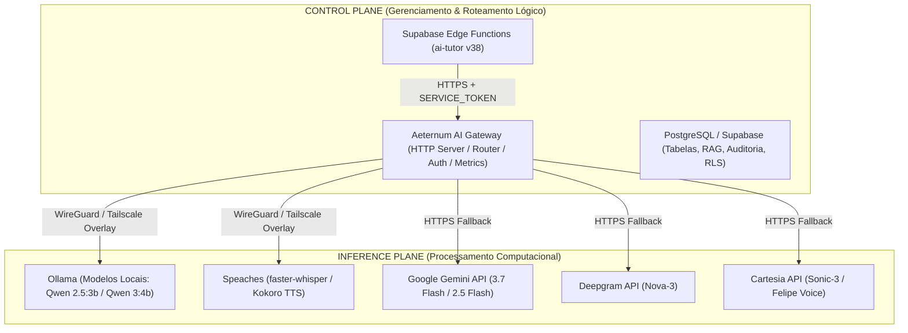

# AETERNUM ATLAS & VITA — FASE 3B.4A.1
## ARQUITETURA DE PRODUÇÃO, CONECTIVIDADE E ALCANCE DO AI GATEWAY (HARDENED)

**Documento:** `PHASE_3B_4_PRODUCTION_GATEWAY_ARCHITECTURE.md`  
**Status:** `PROPOSTA ARQUITETURAL REFINADA / AGUARDANDO AUDITORIA FINAL CHATGPT (3B.4A.1)`  
**Data:** 2026-08-30  
**Branch Base:** `antigravity/phase-3b-atlas-tutor-gateway`  
**Baseline Imutável Verificado:** `475c93e51590a216aba4851389d592934837c24a` (Phase 3B VERIFIED)

---

## 1. SUMÁRIO EXECUTIVO & CONTEXTO

Com a conclusão e verificação da **Fase 3B** (`3B.1`, `3B.2`, `3B.3` e `3B_METADATA_PATCH`), os contratos de aplicação do `ai-tutor` no Supabase Edge e a camada de roteamento/autenticação `SERVICE_TOKEN` do `AeternumAIGateway` foram formalmente validados e testados (303/303 testes unitários e de integração verdes, 0 erros TypeScript).

Contudo, a topologia atual opera sob um invariante de desenvolvimento estrito:
$$\text{Binding Local: } 127.0.0.1:8081 \quad \Longrightarrow \quad \text{Inacessível pelo Supabase Edge em Produção}$$

Este documento estabelece o **design arquitetural de produção** para viabilizar o tráfego seguro, resiliente e auditável entre as Supabase Edge Functions e o AI Gateway, preservando a filosofia **Local-First com Multi-Provider Cloud Fallback** e garantindo que o hardware de desenvolvimento local (**HP Victus**) seja classificado estritamente como **Nó de Desenvolvimento / Piloto**, e não como infraestrutura de produção crítica exposta.

---

## 2. SEPARAÇÃO FUNDAMENTAL DE PLANOS E AMBIENTES

### 2.1. Control Plane vs. Inference Plane
1. **Control Plane (Plano de Controle):**
   - Responsável por autenticação de usuários, autorização multi-tenant, isolamento de instituições, validação de tokens JWT/Service, orquestração de chamadas RAG, persistência de turnos e auditoria.
   - Componentes: Supabase Edge Functions (`ai-tutor`), Supabase PostgreSQL e o `AeternumAIGateway` (orquestrador de tráfego HTTPS/SSE e telemetria).
2. **Inference Plane (Plano de Inferência):**
   - Responsável pela execução de modelos de linguagem (LLM), reconhecimento de fala (STT) e síntese vocal (TTS).
   - Componentes: Motores locais de inferência (Ollama, Speaches) e APIs gerenciadas de nuvem (Gemini, Deepgram, Cartesia).

### 2.2. Dev/Pilot Node vs. Production Infrastructure
- **HP Victus (Ambiente Atual):** Classificado estritamente como **Nó de Piloto Acadêmico / Desenvolvimento**. Suporta validações locais, pareamento com LiveKit local e testes controlados. Proibido de receber exposição direta de portas via NAT ou port forwarding residencial.
- **Produção Multi-Institucional:** Infraestrutura em nuvem conteinerizada com terminação TLS gerenciada, DNS canônico corporativo, segredos injetados por variáveis de ambiente de projeto e monitoramento contínuo.

---

## 3. RESPOSTAS DETALHADAS ÀS 14 QUESTÕES ARQUITETURAIS

### Q1. Onde deve rodar o AI Gateway de produção?
**Resposta:** O AI Gateway deve rodar como um serviço conteinerizado (Node 24 runtime) em uma plataforma com suporte a redes persistentes e baixa latência:
- **Candidato Preferencial (Opção A):** **Fly.io Machine** ou **VM Linux Persistente**, permitindo conectividade overlay nativa com nós de inferência privados.
- **Avaliação do Cloud Run:** Reconhecido como plataforma viável para gateways puramente HTTP, mas requer prova adicional de complexidade para redes privadas em espaço de usuário (Tailscale userspace networking) antes de ser considerado para nós de inferência externos. Não selecionado como plataforma canônica para o piloto.

### Q2. Como as Supabase Edge Functions o alcançarão com segurança?
**Resposta:** Exclusivamente via **HTTPS** através do domínio canônico corporativo:
- **Exemplo Canônico:** `https://gateway.aeternumatlas.com/v1/llm/generate`
- **Requisitos de TLS:** `TLS >= 1.2 OBRIGATÓRIO`, `TLS 1.3 PREFERENCIAL`, `CERTIFICADO PÚBLICO VÁLIDO OBRIGATÓRIO`, `HTTPS ONLY`.

### Q3. Como o Gateway autenticará as requisições do Supabase?
**Resposta:** Através do modo canônico **`SERVICE_TOKEN`** (implementado na Fase 3B.2):
- A Edge Function injeta o cabeçalho `Authorization: Bearer <AETERNUM_AI_GATEWAY_TOKEN>`.
- O Gateway valida o token em tempo constante com `crypto.timingSafeEqual` contra o segredo configurado.
- Requisições sem token, com token incorreto ou contendo JWTs de usuário final são rejeitadas com **HTTP 401 Unauthorized** (`provider_call_count = 0`).
- **Invariante de Egress:** `SUPABASE_EDGE_STATIC_EGRESS_IP = NOT AVAILABLE` (o Supabase Edge não garante IP de saída estático). Portanto, allowlist de IP **NÃO** deve ser um mecanismo de autenticação obrigatório. A segurança baseia-se estritamente em **HTTPS + SERVICE_TOKEN** com WAF/rate-limiting perimétrico.

### Q4. Onde deve rodar a inferência local de produção?
**Resposta:**
1. **Fase Piloto Acadêmico:** Servidor/Desktop dedicado com GPU Nvidia (ex: HP Victus DEV/PILOT node em ambiente controlado).
2. **Fase Produção Multi-Institucional:** Instâncias de GPU Dedicada em nuvem privada ou Servidores On-Premise Universitários dedicados.

### Q5. Como o Gateway alcançará os provedores locais/privados de LLM, STT e TTS?
**Resposta:** Através de uma **Rede Overlay Criptografada (WireGuard / Tailscale)** com endereçamento privado e políticas de rede ACL baseadas em identidade.
- *Classificação de mTLS:* `NOT IMPLEMENTED / OPTIONAL FUTURE HARDENING`. A segurança da camada de rede no piloto fundamenta-se na criptografia e autenticação do túnel WireGuard/Tailscale.
- **Invariante:** Nenhuma porta de inferência (11434, 8000) é exposta à Internet pública.

### Q6. A filosofia Local-First pode ser mantida com segurança em produção?
**Resposta:** **Sim.** O `ProviderRouter` prioriza o nó de inferência privado da rede overlay. Se a latência e o status de saúde do nó local estiverem saudáveis, a inferência ocorre localmente com custo zero de tokens de terceiros. Se o nó local falhar ou sofrer timeout, o `ProviderRouter` aciona automaticamente o fallback em nuvem.

### Q7. Como opera o Cloud Fallback se o nó privado de inferência estiver indisponível?
**Resposta:** Através de **Failover Automático (Best-Effort Automatic Failover)** com **Multi-Provider Resilience**:
1. O Gateway tenta a chamada primária ao nó privado.
2. Ao detectar falha recuperável (`ECONNREFUSED`, `ETIMEDOUT`, `PROVIDER_UNAVAILABLE`), o `ProviderRouter` despacha a requisição para o provedor de nuvem (Gemini para LLM, Deepgram para STT, Cartesia para TTS).
3. O Gateway retorna a resposta com metadados fidedignos (`fallbackUsed: true`, `finalProvider: "gemini-cloud"`, `primaryModel: "ollama-local"`).
4. A Edge Function recebe o retorno, persiste as métricas e emite a resposta via SSE.
*Nota de Resiliência:* Provedores de nuvem estão sujeitos a indisponibilidades, quotas e limites de cobrança.

### Q8. O que acontece se o próprio Gateway estiver indisponível?
**Resposta:** Princípio **Fail-Closed Gracioso**:
- A Edge Function `handleAiTutorRequest` intercepta o erro de rede (`CONNECTION_REFUSED` / `TIMEOUT`).
- Exclui mensagens órfãs criadas no início do turno para garantir integridade.
- Retorna ao cliente **HTTP 503** com código `AI_GATEWAY_UNAVAILABLE`. Nenhum dado confidencial ou traceback é vazado.

### Q9. Como os segredos são provisionados e rotacionados?
**Resposta:**
- **Supabase Edge:** `SUPABASE PROJECT SECRET` (`supabase secrets set`) injetado como variável de ambiente em runtime do Edge (nunca exposto ao navegador).
- **AI Gateway:** Injetado via variáveis de ambiente seguras da plataforma de hospedagem.
- **Rotação de Token:**
  - *Estado Atual:* `SERVICE_TOKEN single-token validation = IMPLEMENTED / TESTED`.
  - *Estado Futuro:* `Dual-token zero-downtime rotation = PLANNED / PRE-PRODUCTION REQUIREMENT` (validação de token primário ou secundário em tempo constante durante janelas de migração).

### Q10. Como a arquitetura escala além do piloto HP Victus?
**Resposta:**
- **Gateway:** Múltiplas instâncias stateless atrás de balanceador HTTPS.
- **Inference Nodes:** Pool de instâncias com balanceamento e roteamento determinístico.
- **Cloud Fallback:** Capacidade elástica gerenciada pelos provedores de nuvem.

### Q11. Quais componentes EXIGEM ingress público?
**Resposta:**
1. **Frontend Web (Vercel):** `https://aeternumatlas.com` (HTTPS :443 público).
2. **Supabase Edge API:** `https://<project-ref>.supabase.co/functions/v1/*` (HTTPS :443 público).
3. **AI Gateway HTTPS Endpoint:** `https://gateway.aeternumatlas.com/v1/*` (HTTPS :443 público, restrito por `SERVICE_TOKEN`).

### Q12. Quais componentes NUNCA devem ter ingress público?
**Resposta:**
1. **Ollama API:** Porta `11434` (estritamente privada/VPN).
2. **Speaches API:** Porta `8000` (estritamente privada/VPN).
3. **Redis Session Store:** Porta `6379` (estritamente privada).
4. **PostgreSQL Database:** Porta `5432` direta.

### Q13. Qual a infraestrutura necessária para o piloto universitário inicial?
**Resposta:**
- 1 Servidor/Desktop Local (GPU Nvidia $\ge 8\text{GB}$ VRAM, Docker).
- Túnel privado WireGuard/Tailscale conectando o Nó Local ao Gateway.
- 1 Instância AI Gateway em nuvem (Fly.io Machine ou VM Linux).
- Supabase Edge Functions configuradas com a URL HTTPS canônica.

### Q14. Qual a infraestrutura necessária para produção multi-institucional?
**Resposta:**
- Instâncias redundantes de AI Gateway.
- Cluster dedicado de inferência privada.
- Cloud Fallback ativo para alta disponibilidade.
- Monitoramento e telemetria estruturada.

---

## 4. ESCOPO DO LIVEKIT & AMBIENTE DE VOZ

- **Classificação de Escopo:** O ingress de produção do LiveKit **NÃO** faz parte do escopo da Fase 3B.4 (focada no AI Gateway e no Tutor).
- **Status do LiveKit:** `LIVEKIT_REAL_ROOM_USER_E2E = PENDING PRE-PRODUCTION QA`.
- O ambiente do LiveKit permanece preservado como validado na Fase 3A.

---

## 5. CANDIDATOS DE PILOTO PRÉ-PRODUÇÃO & MEDIÇÕES OBRIGATÓRIAS

### 5.1. Opções Avaliadas para o Piloto
1. **Opção A (Candidato Preferencial):**
   - Supabase Edge $\rightarrow$ HTTPS $\rightarrow$ Fly.io Machine AI Gateway $\rightarrow$ WireGuard $\rightarrow$ HP Victus DEV/PILOT node $\rightarrow$ Ollama / Speaches.
   - Cloud Fallback disponível diretamente a partir do Gateway em nuvem.
2. **Opção B (Candidato de Contingência):**
   - VM/VPS Linux Persistente $\rightarrow$ Tailscale $\rightarrow$ HP Victus pilot node.

*Nota de Governança:* Nenhuma das opções foi provisionada ainda. A decisão final requer validação prática de latência.

### 5.2. Critérios de Medição de Região & Latência
A escolha de região do Gateway (ex: Fly.io GRU São Paulo vs. us-east) deve ser orientada por evidências empíricas:
- Medir `SB_REGION` de execução da Edge Function.
- Medir latência Edge $\rightarrow$ Gateway.
- Medir latência Gateway $\rightarrow$ Nó de inferência privado via WireGuard.
- Medir latência Gateway $\rightarrow$ Cloud Fallback (Gemini).

### 5.3. Medição de SLO de Fallback (Hard vs. Soft Failures)
Não se adota um teto arbitrário (ex: <500ms) sem base factual. O laboratório pré-produção deve mensurar separadamente:
- **Hard Failure:** `ECONNREFUSED` / nó indisponível (detecção de conexão TCP recusada).
- **Soft Failure:** Timeout de inferência / resposta truncada (detecção por deadline).
- Reportar métricas em percentis: **p50, p95, p99**.

---

## 6. REQUISITOS OBRIGATÓRIOS PARA O CUTOVER DE PRODUÇÃO

Para que a migração do `ai-tutor` em produção seja autorizada em fases futuras:
1. AI Gateway de produção implantado e respondendo em endpoint HTTPS estável com certificado TLS válido (`gateway.aeternumatlas.com`).
2. Conexão overlay privada (WireGuard/Tailscale) comprovada e com latência aferida entre o Gateway e o nó de inferência.
3. `AETERNUM_AI_GATEWAY_URL` e `AETERNUM_AI_GATEWAY_TOKEN` configurados via Supabase Project Secrets.
4. Suporte a rotação de tokens com validação dual (dual-token rotation) implementado no Gateway.
5. Bateria de testes de homologação pré-produção executada com 100% de sucesso.
6. Aprovação explícita e formal da auditoria técnica do ChatGPT.

---

**STATUS:**  
`PHASE 3B.4A.1 — ARQUITETURA DE PRODUÇÃO REFINADA / AGUARDANDO AUDITORIA FINAL CHATGPT`
