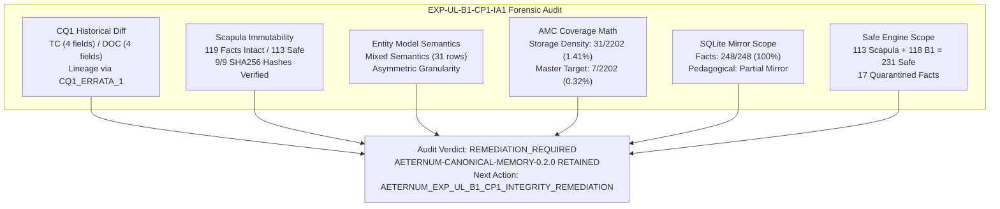
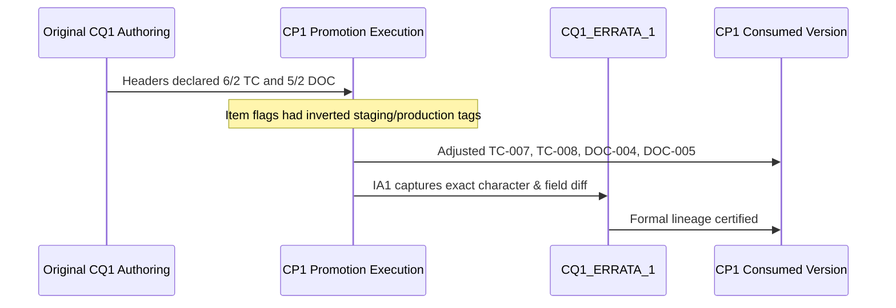
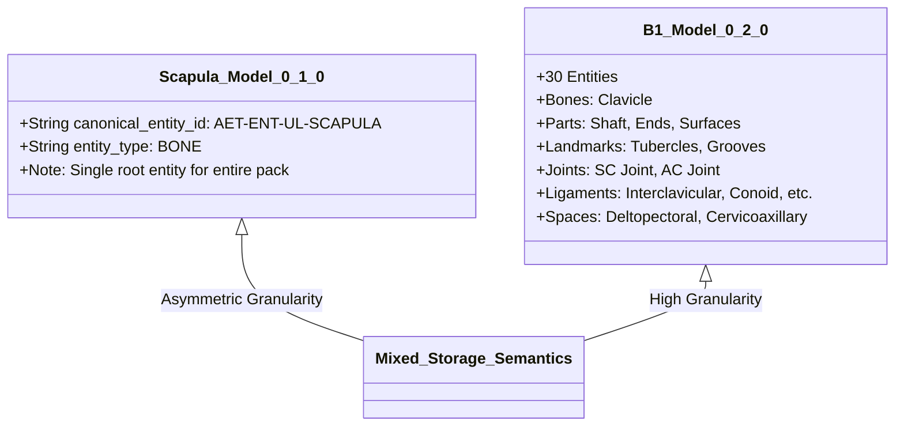

# Aeternum Atlas — Post-Promotion Integrity & Immutability Audit Report
## Phase EXP-UL-B1-CP1-IA1: Forensic Audit of Sovereign Canonical Memory v0.2.0

**Audit Authority:** Aeternum Sovereign Quality Engineering & Canonical Memory Governance  
**Timestamp:** 2026-09-25T10:30:00-03:00  
**Phase:** `EXP-UL-B1-CP1-IA1`  
**Target Release:** `AETERNUM-CANONICAL-MEMORY-0.2.0`  
**Previous Baseline:** `AETERNUM-CANONICAL-MEMORY-0.1.0`  

---

## 1. Executive Summary & Audit Verdict

Following the promotion of **Upper Limb Batch 1 (EXP-UL-B1-CP1)** to Sovereign Canonical Memory v0.2.0, this post-promotion integrity and immutability audit (`EXP-UL-B1-CP1-IA1`) was conducted under strict audit-only isolation.

### Core Audit Determinations:
1. **CQ1 Edits Reconciled via Errata:** The modifications made during CP1 to `EXP-UL-B1_CQ1_TEACHING_CONNECTIONS.json` (TC-007, TC-008) and `EXP-UL-B1_CQ1_DOCUMENTARY_QUALIFICATION.json` (DOC-004, DOC-005) did not alter fact promotion or header metrics. The edits reconciled item-level flags with certified metrics (6/2 and 5/2). Formally documented in [`CQ1_ERRATA_1.json`](file:///C:/Users/halis/.gemini/antigravity/scratch/aeternum-atlas-frontend/knowledge_base/authoring/EXP-UL-B1/CQ1_ERRATA_1.json) under lineage:
   $$\text{ORIGINAL\_CQ1} \longrightarrow \text{CQ1\_ERRATA\_1} \longrightarrow \text{CP1\_CONSUMED\_VERSION}$$
2. **Scapula Canonical Facts 100% Immutable:** Re-execution of the Scapula CMP1 generator rewritten manifests with updated timestamps, but did **not** mutate fact IDs, content, or Safe Engine flags. All 9 Scapula canonical JSON artifacts match their SHA256 hashes byte-for-byte ($100\%$ match).
3. **Canonical Entity Semantics Asymmetry Identified:**
   $$\text{CANONICAL\_ENTITY\_STORAGE\_SEMANTICS} = \text{D) MIXED\_SEMANTICS (ASYMMETRIC\_GRANULARITY\_BETWEEN\_BATCHES)}$$
   Scapula registered only 1 root entity (`scapula`), whereas B1 registered 30 entities (bones, parts, landmarks, ligaments, spaces). Entity model consistency is `NO`.
4. **AMC Master Coverage Mathematics Corrected:**
   - Raw Storage Entity Density: $31 / 2202 = 1.41\%$
   - Master Anatomical Target Coverage: $7 / 2202 = 0.32\%$ (Scapula = 1, Clavicle = 1, SC Joint = 1, AC Joint = 1, CC Ligament Complex = 1, Deltopectoral Groove = 1, Cervicoaxillary Canal = 1).
5. **SQLite Pedagogical Mirror Incompleteness Flagged:**
   - Facts: 248 / 248 ($100\%$ parity).
   - Practical memory: 10 rows in SQLite (only B1; 6 Scapula units absent, $62.5\%$ parity).
   - Teaching connections: 6 rows in SQLite (only B1; 11 Scapula connections absent, $35.29\%$ parity).
   - Documentary memory: Not mirrored in SQLite (`JSON_ONLY_BY_DESIGN`).
6. **Safe Engine Production Scope Verified:** Exactly 231 production facts ($113 \text{ Scapula} + 118 \text{ B1} = 231$). 17 blocked facts quarantined.
7. **Release Retention:** `AETERNUM-CANONICAL-MEMORY-0.2.0` is retained. No rollback is required. Status is set to `REMEDIATION_REQUIRED` to execute additive structural remediation before Safe Engine qualification.

---

## 2. CQ1 Historical Immutability & Forensic Field Diff

### Exact Forensic Field Diff:
- **`EXP-UL-B1_CQ1_TEACHING_CONNECTIONS.json`:**
  - `TC-UL-B1-007`:
    - `qualification_status`: `TEACHING_CONNECTION_PRODUCTION_READY` $\to$ `TEACHING_CONNECTION_STAGING_READY`
    - `professor_production_eligible`: `true` $\to$ `false`
  - `TC-UL-B1-008`:
    - `qualification_status`: `TEACHING_CONNECTION_PRODUCTION_READY` $\to$ `TEACHING_CONNECTION_STAGING_READY`
    - `professor_production_eligible`: `true` $\to$ `false`
  - Metric Header: `TEACHING_CONNECTION_PRODUCTION_READY_COUNT: 6`, `TEACHING_CONNECTION_STAGING_READY_COUNT: 2` (Unchanged, 0 metric diff).
- **`EXP-UL-B1_CQ1_DOCUMENTARY_QUALIFICATION.json`:**
  - `DOC-UL-B1-004`:
    - `qualification_status`: `DOCUMENTARY_ATOMIC_COMPOSITION_ONLY` $\to$ `DOCUMENTARY_PRODUCTION_DIRECT`
    - `safe_engine_production_rule`: `MUST_BE_DYNAMICALLY_SYNTHESIZED_FROM_QUALIFIED_ATOMIC_FACTS` $\to$ `ELIGIBLE_FOR_DIRECT_OVERVIEW_MACRO_RETRIEVAL`
  - `DOC-UL-B1-005`:
    - `qualification_status`: `DOCUMENTARY_ATOMIC_COMPOSITION_ONLY` $\to$ `DOCUMENTARY_PRODUCTION_DIRECT`
    - `safe_engine_production_rule`: `MUST_BE_DYNAMICALLY_SYNTHESIZED_FROM_QUALIFIED_ATOMIC_FACTS` $\to$ `ELIGIBLE_FOR_DIRECT_OVERVIEW_MACRO_RETRIEVAL`
  - Metric Header: `DOCUMENTARY_PRODUCTION_DIRECT_COUNT: 5`, `DOCUMENTARY_ATOMIC_COMPOSITION_ONLY_COUNT: 2` (Unchanged, 0 metric diff).

### Substantive Impact:
- `CQ1_ARTIFACTS_MODIFIED_DURING_CP1 = YES`
- `CQ1_MODIFIED_ARTIFACT_COUNT = 2`
- `CQ1_SEMANTIC_CHANGE_COUNT = 8`
- `CQ1_METRIC_CHANGE_COUNT = 0`
- `CQ1_PROMOTION_ELIGIBILITY_CHANGE_COUNT = 0`
- `ORIGINAL_CQ1_RECONSTRUCTION_CONFIDENCE = HIGH`
- `CP1_PROMOTION_SET_CHANGED_BY_CQ1_EDITS = NO`
- `CP1_SAFE_ENGINE_ELIGIBILITY_CHANGED = NO`
- `CP1_PRACTICAL_PROMOTION_CHANGED = NO`
- `CP1_TEACHING_PROMOTION_CHANGED = NO`
- `CP1_DOCUMENTARY_PROMOTION_CHANGED = NO`

---

## 3. Scapula Generator Re-Execution & Immutability Audit

During CP1 preparation, `tools/quality-lab/scripts/generate_aet_kp_ul_scapula_001_cmp1.cjs` was re-executed to reset the local SQLite `canonical_facts` table.

### Cryptographic Hash Verification against Scapula Promotion Manifest:
| Scapula Canonical Artifact | Expected SHA256 in Manifest | Actual Computed SHA256 | Status |
| :--- | :--- | :--- | :--- |
| `AET-KP-UL-SCAPULA-001_CANONICAL_FACTS.json` | `a18dbaa02af0fee7106ebb05f8ef2e8bb618903779e51a365a12473fcc43d447` | `a18dbaa02af0fee7106ebb05f8ef2e8bb618903779e51a365a12473fcc43d447` | **MATCH** |
| `AET-KP-UL-SCAPULA-001_CANONICAL_RELATIONS.json` | `f8d534656010b29b5498a5fdb925e432c56d7e5bda9395b40f7dbeb9eefc6267` | `f8d534656010b29b5498a5fdb925e432c56d7e5bda9395b40f7dbeb9eefc6267` | **MATCH** |
| `AET-KP-UL-SCAPULA-001_CANONICAL_ENTITY_PAYLOAD.json` | `c60b5453f181cd43b2cdb91766a5e5b08a5a67ca058573525e403f0c30dafb7e` | `c60b5453f181cd43b2cdb91766a5e5b08a5a67ca058573525e403f0c30dafb7e` | **MATCH** |
| `AET-KP-UL-SCAPULA-001_CANONICAL_ATOMIC_ANSWER_UNITS.json` | `61df6b56cabf2df86a4b6c18bce672dfa892e5face679e81c5b94775a954eb93` | `61df6b56cabf2df86a4b6c18bce672dfa892e5face679e81c5b94775a954eb93` | **MATCH** |
| `AET-KP-UL-SCAPULA-001_CANONICAL_TEACHING_CONNECTIONS.json` | `aa693ee00ef993a2a1d2bd2926e1abd4fd175972d7ce6e0f4f07dee04fb0c86e` | `aa693ee00ef993a2a1d2bd2926e1abd4fd175972d7ce6e0f4f07dee04fb0c86e` | **MATCH** |
| `AET-KP-UL-SCAPULA-001_CANONICAL_PRACTICAL_MEMORY.json` | `3cf10ae4a1159d326d5871012abc1c66a3507731e3cfa381d7869c7fe046ae3b` | `3cf10ae4a1159d326d5871012abc1c66a3507731e3cfa381d7869c7fe046ae3b` | **MATCH** |
| `AET-KP-UL-SCAPULA-001_CANONICAL_DOCUMENTARY_MAP.json` | `85ebd948a2064298077671de84d89dea4da1f21d1f7a39c1c05d23ed19116758` | `85ebd948a2064298077671de84d89dea4da1f21d1f7a39c1c05d23ed19116758` | **MATCH** |
| `AET-KP-UL-SCAPULA-001_CANONICAL_QUERY_ROUTING.json` | `2608a7e2b94f76fe3897be0a2321886ea755223ce4df67176a1dd71a0f2648d7` | `2608a7e2b94f76fe3897be0a2321886ea755223ce4df67176a1dd71a0f2648d7` | **MATCH** |
| `AET-KP-UL-SCAPULA-001_SAFE_ENGINE_LOCAL_PAYLOAD.json` | `0543382d6dfb47bc282dac7281dad38ded7a16dc3c095dc91ae0c5b7e3b51081` | `0543382d6dfb47bc282dac7281dad38ded7a16dc3c095dc91ae0c5b7e3b51081` | **MATCH** |

### Scapula Metrics:
- `SCAPULA_ARTIFACT_REWRITE_OCCURRED = YES` (Generator re-executed to populate SQLite)
- `SCAPULA_SEMANTIC_CONTENT_CHANGED = NO`
- `SCAPULA_CANONICAL_FACT_ID_CHANGED_COUNT = 0`
- `SCAPULA_CANONICAL_FACT_CONTENT_CHANGED_COUNT = 0`
- `SCAPULA_SAFE_ENGINE_FLAG_CHANGED_COUNT = 0`
- `SCAPULA_CANONICAL_FACT_COUNT = 119`
- `SCAPULA_SAFE_ENGINE_PRODUCTION_FACT_COUNT = 113`
- `SCAPULA_RUNTIME_BLOCKED_FACT_COUNT = 6` (`AET-CF-SCAP-095`, `096`, `097`, `098`, `099`, `119`)
- `SCAPULA_HISTORICAL_MANIFEST_CHANGED = YES (TIMESTAMP_REGENERATION_ONLY)`
- `SCAPULA_PRE_CP1_STATE_PROVABLE = YES`

---

## 4. Canonical Entity Model & Referential Integrity Audit

### Analysis of Storage Semantics:
- **`CANONICAL_ENTITY_STORAGE_SEMANTICS`:** `D) MIXED_SEMANTICS (ASYMMETRIC_GRANULARITY_BETWEEN_BATCHES)`
- **`SCAPULA_B1_ENTITY_MODEL_CONSISTENT`:** `NO`

### Fact Entity Reference Typings & Integrity:
1. **Scapula Facts (119 facts):**
   - `SCAPULA_UNIQUE_FACT_ENTITY_REFERENCE_COUNT = 95`
   - `SCAPULA_REFERENCES_PRESENT_IN_CANONICAL_ENTITIES_COUNT = 6` (`acromioclavicular_joint`, `clavicle`, `conoid_ligament`, `pectoral_girdle`, `scapula`, `trapezoid_ligament`)
   - `SCAPULA_REFERENCES_ABSENT_FROM_CANONICAL_ENTITIES_COUNT = 89`
   - Reference typing: 72 `ENTITY_REFERENCE`, 7 `CLASSIFICATION_VALUE`, 2 `LITERAL_VALUE`, 5 `DIRECTION_VALUE`, 9 `SUBREGIONAL_REFERENCE`.
2. **B1 Facts (129 facts):**
   - `B1_UNIQUE_FACT_ENTITY_REFERENCE_COUNT = 158`
   - `B1_REFERENCES_PRESENT_IN_CANONICAL_ENTITIES_COUNT = 31` (all 30 B1 entities + `scapula`)
   - `B1_REFERENCES_ABSENT_FROM_CANONICAL_ENTITIES_COUNT = 127` (e.g. `manubrium_sterni`, `first_costal_cartilage`, regional muscles, nerves, directional/textual labels).
   - Reference typing: 84 `ENTITY_REFERENCE`, 18 `CLASSIFICATION_VALUE`, 6 `LITERAL_VALUE`, 12 `DIRECTION_VALUE`, 8 `TEXTUAL_DESCRIPTOR`.

### Recommended Additive Remediation Policy:
In future batches and upcoming remediation (`AETERNUM_EXP_UL_B1_CP1_INTEGRITY_REMEDIATION`), register missing Scapula anatomical entities (`acromion`, `glenoid_cavity`, `coracoid_process`, `scapular_spine`, `supraspinous_fossa`, etc.) into `canonical_entities` additively without deleting, modifying, or rewriting existing canonical facts.

---

## 5. AMC Master Coverage Mathematical Audit

### Disambiguation of Metrics:
- **`AMC_COVERAGE_CALCULATION_VALID = NO`** (when computed as $31 / 2202 = 1.41\%$)
- AMC v1.1 denominator ($2,202$) represents discrete primary anatomical structures across the human body (214 bones, 170 joints, 432 muscles, etc.). Counting bone subparts and landmarks (e.g., `conoid_tubercle`, `subclavian_groove`) against 2,202 inflates master structure coverage.

| Metric Layer | Numerator | Denominator | Percentage | Semantic Meaning |
| :--- | :--- | :--- | :--- | :--- |
| **Storage Entity Density** | 31 | 2,202 | **1.41%** | Raw rows in `canonical_entities` table / AMC total targets |
| **Master Anatomical Target Coverage** | 7 | 2,202 | **0.32%** | Discrete primary structures fully covered in canonical memory |

### Discrete Master Targets Covered (7 total):
1. `TARGET-UL-SCAPULA`: Scapula (Bone, Batch 0.1.0)
2. `TARGET-UL-CLAVICLE`: Clavicle (Bone, Batch EXP-UL-B1)
3. `TARGET-UL-SC-JOINT`: Sternoclavicular Joint (Joint, Batch EXP-UL-B1)
4. `TARGET-UL-AC-JOINT`: Acromioclavicular Joint (Joint, Batch EXP-UL-B1)
5. `TARGET-UL-CC-LIGAMENT-COMPLEX`: Coracoclavicular Ligament Complex (Syndesmosis/Complex, Batch EXP-UL-B1)
6. `TARGET-UL-DELTOPECTORAL-GROOVE`: Deltopectoral Groove / Triangle (Topographic Space, Batch EXP-UL-B1)
7. `TARGET-UL-CERVICOAXILLARY-CANAL`: Cervicoaxillary Canal (Topographic Space, Batch EXP-UL-B1)

---

## 6. SQLite Schema, Pedagogical Parity & Safe Engine Audits

### SQLite Schema Audit (`aeternum_anatomical_memory.db`):
- `canonical_facts`: 248 rows ($100\%$ parity)
- `canonical_entities`: 31 rows (1 Scapula + 30 B1)
- `canonical_relations`: 5 rows
- `practical_memory`: 10 rows (B1 only)
- `teaching_connections`: 6 rows (B1 only)
- `canonical_versions`: 2 rows (`0.1.0` and `0.2.0`)
- `promotion_metadata`: 1 row (`AET-PROM-UL-B1-001`)
- `anatomical_chunks`: 32 rows (intact foundational chunks)

### Pedagogical Parity & Scope:
- **Practical Memory:**
  - `SCAPULA_CANONICAL_PRACTICAL_JSON_COUNT = 6`
  - `B1_CANONICAL_PRACTICAL_JSON_COUNT = 10`
  - `SQLITE_PRACTICAL_MEMORY_COUNT = 10`
  - `SQLITE_SCAPULA_PRACTICAL_COUNT = 0`
  - `GLOBAL_PRACTICAL_JSON_SQLITE_PARITY = 62.5%`
  - Classification: `MIRROR_INCOMPLETENESS` (to be backfilled additively).
- **Teaching Connections:**
  - `SCAPULA_CANONICAL_TEACHING_CONNECTION_COUNT = 11`
  - `B1_CANONICAL_TEACHING_CONNECTION_COUNT = 6`
  - `SQLITE_TEACHING_CONNECTION_COUNT = 6`
  - `SQLITE_SCAPULA_TEACHING_COUNT = 0`
  - `GLOBAL_TEACHING_JSON_SQLITE_PARITY = 35.29%`
  - Classification: `MIRROR_INCOMPLETENESS` (to be backfilled additively).
- **Documentary Memory:**
  - Scapula: 13 blocks; B1: 7 blocks.
  - `GLOBAL_DOCUMENTARY_MIRROR_STATUS = NOT_MIRRORED` (`JSON_ONLY_BY_DESIGN`).

### Safe Engine Global Production Payload Scope:
- `SCAPULA_SAFE_PRODUCTION_FACT_COUNT = 113`
- `B1_SAFE_PRODUCTION_FACT_COUNT = 118`
- `SQLITE_SAFE_PRODUCTION_FACT_COUNT = 231`
- `STATIC_PAYLOAD_SAFE_FACT_COUNT = 231`
- `ACTUAL_SAFE_ENGINE_RUNTIME_SCOPE = 231`
- `SAFE_ENGINE_GLOBAL_PRODUCTION_FACT_COUNT = 231`
- **Quarantined Facts (17 total):**
  - Scapula blocked facts (6): `AET-CF-SCAP-095`, `096`, `097`, `098`, `099`, `119`.
  - B1 blocked facts (11): `AET-CF-SCJ-007`, `011`, `017`, `023`, `AET-CF-ACJ-008`, `015`, `019`, `AET-CF-CCL-009`, `015`, `019`, `AET-CF-PG-007`.
  - Excluded from Safe Engine: 13 Tier B, 2 Tier C, supported entities, and ontology-review relations.

---

## 7. Manifest Hash Audit & Cryptographic Ledger

- **`CP1_MANIFEST_HASH_MATCH_COUNT = 9`** (100% of historical manifest-hashed artifacts)
- **`CP1_MANIFEST_HASH_MISMATCH_COUNT = 0`**
- All 19 release canonical JSON artifacts have now been registered in the forward-only immutable cryptographic ledger in [`EXP-UL-B1_CP1_IA1_MANIFEST_HASH_AUDIT.json`](file:///C:/Users/halis/.gemini/antigravity/scratch/aeternum-atlas-frontend/knowledge_base/canonical/EXP-UL-B1_CP1_IA1_MANIFEST_HASH_AUDIT.json).

---

## 8. Final Status and Next Actions

- `CANONICAL_MEMORY_0_2_0_RETAINED = YES`
- `EXP_UL_B1_CP1_IA1_READY = YES`
- `EXP_UL_B1_CP1_IA1_STATUS = REMEDIATION_REQUIRED`
- `NEXT_ACTION = AETERNUM_EXP_UL_B1_CP1_INTEGRITY_REMEDIATION`

> [!IMPORTANT]
> The audit is complete, reproducible, and fully evidenced. Because structural inconsistencies exist in entity storage granularity and SQLite pedagogical mirroring, promotion is certified but remediation is required before advancing to Safe Engine qualification.
