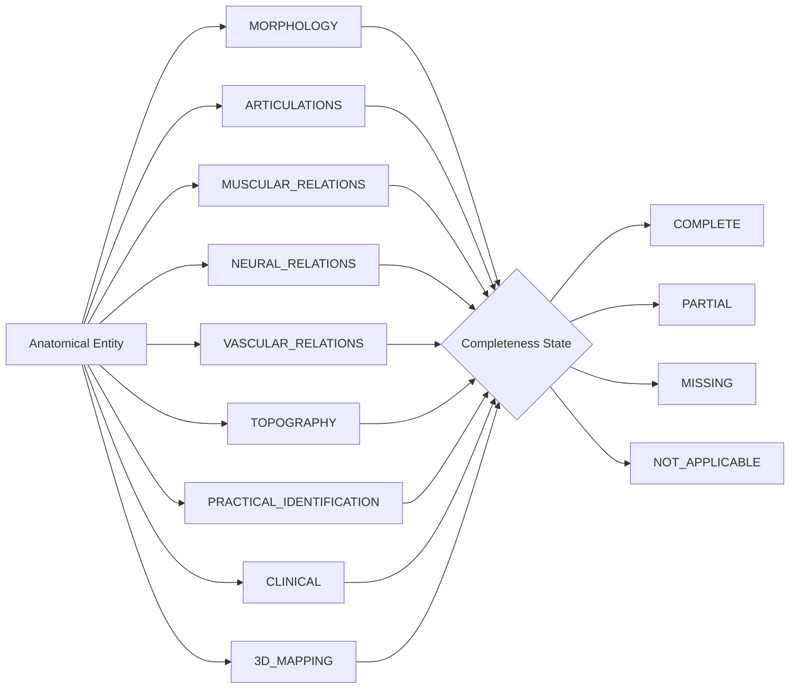

# AETERNUM ANATOMICAL COGNITIVE MODEL (AACM)
**Version:** AACM 1.0  
**Status:** CANONICAL GOVERNANCE CONTRACT  
**Domain:** Sovereign Anatomical Reasoning, Memory Governance, Retrieval & Pedagogical Architecture  

---

## 1. Canonical Definition & Scope

The **Aeternum Anatomical Cognitive Model (AACM)** formalizes permanently the foundational reasoning, knowledge architecture, retrieval orchestration, and pedagogical delivery patterns governing the Aeternum Atlas ecosystem.

The AACM decouples anatomical truth from external generative large language models. The LLM does not define anatomical facts; rather, Aeternum’s sovereign memory, structural taxonomy, and cognitive templates define the boundaries, relations, and teaching vectors.

The AACM governs:
1. **Anatomical Memory Authoring**: Structural guidelines for authoring, curating, and indexing anatomical knowledge chunks.
2. **Corpus Expansion**: Metric-driven expansion priorities across domains, subdomains, and relational dimensions.
3. **Entity & Relation Design**: Canonical representations of anatomical structures, spaces, and their topological connections.
4. **Retrieval Orchestration**: Multi-stage, evidence-first retrieval across local and cloud substrates.
5. **Atlas IA Response Composition**: Dynamic generation of structured panoramic macro-overviews and laser-targeted micro-answers.
6. **Vita Tutor Behavior**: Pedagogical reasoning mimicking an experienced human professor of gross and practical anatomy.
7. **Future SAF-F1 Deterministic Engine**: Fact-graph compatibility and zero-hallucination verification gates.
8. **Morgue Practical Anatomy Integration**: Integration of cadaveric prosection landmarks, palpatory anatomy, and lab tips.
9. **3D Viewer Context**: Spatial alignment with interactive 3D model nodes, mesh hierarchies, and visual annotations.

---

## 2. Immutable Core Principles

The AACM is anchored upon three non-negotiable architectural rules:

### 2.1. The Macro Query Rule
> **Rule Definition:** When a student queries a broad anatomical structure, region, organ system, or overarching theme, Aeternum must construct an organized, relational anatomical panorama.

- **Pedagogical Principle:** Macro does **not** mean an unorganized data dump of raw database records. It represents a structured, pedagogical overview characterized by ordered sections, explicit relational connections, and progressive cognitive depth.
- **Panoramic Structure Dimensions (where applicable):**
  1. *Identity & Classification*: Systemic category, anatomical terminology (TA2).
  2. *Morphology & Geometry*: Form, surfaces (faces), borders (margins), angles, extremities, processes.
  3. *Location & Orientation*: Anatomical position, syntopy, holotopy, skeletotopy.
  4. *Articulations & Joint Mechanics*: Articular facets, participating bones, functional classification.
  5. *Ligamentous & Capsular Apparatus*: Intrinsic and extrinsic stabilizing structures.
  6. *Muscular Attachments & Relations*: Origins, insertions, muscular beds, adjacent muscular compartments.
  7. *Neural Relations*: Innervation, traversing nerves, proximity to vulnerable branches.
  8. *Vascular Relations*: Arterial supply, venous drainage pathways, lymphatic territories.
  9. *Topography & Compartmental Boundaries*: Anatomical spaces, triangles, canals, fossae (walls, floors, roofs, contents).
  10. *Practical & Cadaveric Recognition*: Distinguishing landmarks in specimens, tactile identification.
  11. *Clinical & Functional Correlations*: Applied clinical anatomy, entrapment sites, fracture vulnerabilities.
  12. *3D Viewer Context*: Spatial orientation in the interactive 3D scene.

### 2.2. The Micro Query Rule
> **Rule Definition:** When a student requests a specific anatomical fact, Aeternum must answer that fact directly without forcing the user through the entire parent structure.

- **Mandatory Response Order:**
  $$\text{DIRECT ANSWER} \longrightarrow \text{IMMEDIATE ANATOMICAL CONTEXT} \longrightarrow \text{OPTIONAL HIGH-VALUE CONNECTION}$$
- **Prohibited Anti-Pattern:** Automatically dumping the entire general morphology of a bone or organ when asked a singular micro-fact (e.g., replying with a full essay on the humerus when asked only what passes through the radial groove).
- **Canonical Micro Query Intent Types:**
  - What innervates structure $X$?
  - What supplies arterial blood to structure $X$?
  - Where does muscle $X$ originate / insert?
  - What does bone $X$ articulate with at landmark $Y$?
  - What structure passes through foramen / canal $X$?
  - What passes between structure $X$ and structure $Y$?
  - What structure lies immediately anterior / posterior / medial / lateral to $X$?
  - What are the specific anatomical boundaries of space $X$?

### 2.3. The Professor Connection Rule
> **Rule Definition:** Aeternum must prefer pedagogically meaningful anatomical connections rather than isolated, disconnected trivia. Connections must mirror the reasoning of a master anatomy professor in the dissection hall.

- **Relational Vectors of Professor Reasoning:**
  - *Bone Landmark $\longleftrightarrow$ Muscle Attachment*: Associating the infraglenoid tubercle with the long head of the triceps brachii.
  - *Bone Landmark $\longleftrightarrow$ Vulnerable Nerve*: Associating the surgical neck of the humerus with the axillary nerve.
  - *Nerve $\longleftrightarrow$ Vascular Companion*: Associating the radial nerve with the deep artery of the arm in the radial groove.
  - *Nerve $\longleftrightarrow$ Muscular Compartment*: Associating the musculocutaneous nerve with piercing the coracobrachialis to run between biceps and brachialis.
  - *Artery $\longleftrightarrow$ Topographic Triangle*: Associating the facial artery with the submandibular triangle.
  - *Space Boundaries $\longleftrightarrow$ Pathological Herniation / Entrapment*: Associating carpal tunnel boundaries with median nerve compression.
  - *Structure $\longleftrightarrow$ Cadaveric Dissection Landmark*: Associating the tendon of the palmaris longus as a guide to finding the median nerve at the wrist.
- **Critical Safety Constraint:** A professor connection may **only** be produced when supported by verified Aeternum sovereign evidence. Pedagogical flair or humanization must **never** justify speculative fabrication.

---

## 3. Query Scope Taxonomy

Aeternum classifies incoming anatomical interactions into 9 non-frozen deterministic scopes:

| Query Scope | Intent & Description | Deterministic Query Example |
| :--- | :--- | :--- |
| `MACRO_OVERVIEW` | Panoramic, multi-dimensional relational survey of a major structure, bone, organ, or region. | *"Explique a escápula e suas relações."* |
| `FOCUSED_OVERVIEW` | Detailed survey of a specific functional subsystem or compartment of an entity. | *"Descreva o compartimento anterior do braço."* |
| `MICRO_FACT` | Direct lookup of a singular anatomical property (innervation, attachment, blood supply). | *"Qual músculo se insere na tuberosidade do rádio?"* |
| `RELATION_QUERY` | Spatial, articular, or syntopic relationship between two or more named entities. | *"Entre quais músculos passa o nervo musculocutâneo?"* |
| `TOPOGRAPHIC_QUERY` | Precise boundary definitions (walls, floor, roof) and internal contents of an anatomical space. | *"Quais são os limites e o conteúdo do canal do carpo?"* |
| `PRACTICAL_IDENTIFICATION_QUERY`| Recognition, side determination (laterality), and cadaveric prosection inspection. | *"Como diferenciar a face anterior da posterior da escápula na peça?"* |
| `COMPARISON_QUERY` | Comparative morphological and functional analysis between paired or homologous entities. | *"Quais as diferenças estruturais entre o menisco medial e lateral do joelho?"* |
| `CLINICAL_ANATOMY_QUERY` | Correlation between structural anatomy and clinical syndromes or vulnerabilities. | *"Por que a lesão do colo cirúrgico do úmero afeta a abdução do braço?"* |
| `VIEWER_CONTEXT_QUERY` | Queries anchored to currently selected 3D model nodes or inspection cameras. | *(User selects biceps)* *"Quem inerva esta estrutura selecionada?"* |

---

## 4. Entity Cognitive Templates

Every anatomical entity represented in Aeternum memory adheres to an entity cognitive template.

### 4.1. Generic Entity Knowledge Model (25 Dimensions)
1. `identity`: Primary canonical identifier (e.g., `scapula`).
2. `synonyms`: Vernacular, clinical, and historical synonyms.
3. `terminology`: Latin Terminologia Anatomica (TA2) official nomenclature.
4. `type`: Structural category (`BONE`, `MUSCLE`, `NERVE`, etc.).
5. `domain`: Major body domain (`UPPER_LIMB`, `THORAX`, etc.).
6. `region`: Specific sub-region (`shoulder_girdle`, `arm`, etc.).
7. `system`: Systemic classification (`skeletal`, `muscular`, `nervous`, etc.).
8. `morphology`: General shape, geometry, surfaces, borders, angles.
9. `location`: Anatomical location, coordinates, relative syntopy.
10. `orientation`: Rules for determining standard anatomical position and laterality.
11. `parts`: Subdivisions, lobes, heads, segments, extremities.
12. `relations`: Syntopy with surrounding soft tissues and organs.
13. `muscular_relations`: Origins, insertions, muscular beds.
14. `articulations`: Joints formed, articular surfaces, mechanics.
15. `ligaments`: Capsular and accessory ligamentous attachments.
16. `neural_relations`: Innervation and neighboring nerve pathways.
17. `vascular_relations`: Arterial supply, venous tributaries, lymphatics.
18. `topography`: Involvement in topographic spaces, walls, and canals.
19. `spaces`: Enclosed or bordering spaces.
20. `function`: Biomechanical or physiological action.
21. `clinical_anatomy`: Vulnerabilities, fractures, impingements, clinical signs.
22. `variation`: Documented anatomical variations (e.g., absent plantaris).
23. `practical_identification`: Distinguishing physical features in prosections.
24. `3d_context`: Associated 3D mesh identifiers, bounding centers, camera presets.
25. `teaching_connections`: Structured professor connections linking to other entities.

---

### 4.2. Type-Specific Cognitive Templates (13 Structural Types)

#### 1. BONE
- `morphology`: Flat, long, short, irregular, sesamoid; general architectural shape.
- `faces_and_borders`: Anterior, posterior, medial, lateral faces; superior, inferior, lateral borders.
- `processes_and_landmarks`: Spines, tubercles, tuberosities, epicondyles, lines, crests, fossae.
- `articulations`: Articular facets, participating bones, joint types.
- `muscular_attachments`: Exact bony landmarks for muscular origins and insertions.
- `ligamentous_attachments`: Insertions of stabilizing ligaments.
- `neurovascular_relations`: Grooves, notches, or canals conveying nerves and vessels (e.g., radial groove).
- `practical_orientation`: Rule of thumb to determine right vs. left in an isolated dry bone.
- `3d_context`: Mesh node ID, visual landmarks.

#### 2. MUSCLE
- `origin`: Proximal / fixed skeletal or fascial attachment.
- `insertion`: Distal / mobile skeletal or soft-tissue attachment.
- `action`: Concentric, eccentric, and stabilizing biomechanical functions.
- `innervation`: Motor nerve, spinal cord root levels (e.g., $C5-C6$).
- `arterial_supply`: Primary nutrient arteries and anastomotic arcades.
- `relations`: Superficial, deep, medial, and lateral muscular relations.
- `compartment`: Fascial compartment containment (e.g., anterior compartment of thigh).
- `clinical`: Testing maneuver, tendon reflex, avulsion risks.
- `practical`: Dissection plane, tendon identification in the morgue.
- `3d_context`: Mesh representation, origin-to-insertion vector.

#### 3. NERVE
- `origin`: Plexus cord, spinal root levels, or brainstem nucleus.
- `course`: Anatomical pathway through regions, fascial piercings, topographic passages.
- `branches`: Muscular, articular, cutaneous, and vascular branches.
- `motor_distribution`: Complete inventory of innervated muscles.
- `sensory_distribution`: Cutaneous dermatomes and autonomous sensory zones.
- `relations`: Accompanying arteries and veins (neurovascular bundle).
- `clinical`: Entrapment sites, compression syndromes, signature palsy deformities (e.g., wrist drop).
- `practical`: Landmark for identifying the nerve trunk in a cadaver.
- `3d_context`: Spline / mesh representation.

#### 4. ARTERY
- `origin`: Parent vessel or branch point.
- `course`: Trajectory, anatomical landmarks passed, fascial relations.
- `relations`: Accompanying veins (venae comitantes) and satellite nerves.
- `branches`: Parietal, visceral, terminal, and collateral branches.
- `territory`: Tissues and organs perfused.
- `anastomoses`: Collateral circulations and arcades (e.g., scapular anastomosis).
- `termination`: Bifurcation or continuation into distal named arteries.
- `clinical`: Pulse palpation points, compression sites for hemorrhage control, aneurysm risks.
- `practical`: Distinguishing features in prosections (muscular wall vs. collapsed vein).
- `3d_context`: Vascular tree node.

#### 5. VEIN
- `tributaries`: Confluent veins forming the trunk.
- `course`: Superficial vs. deep fascial relationships.
- `relations`: Adjacent arteries and cutaneous nerves.
- `valves`: Presence, density, and functional significance of venous valves.
- `drainage_destination`: Caval vs. portal system termination.
- `clinical`: Phlebitis, thrombosis risk, catheterization / venipuncture access points.
- `practical`: Recognition of valved vessels and wall thickness differences.
- `3d_context`: Venous mesh network.

#### 6. JOINT
- `classification`: Structural (synovial, fibrous, cartilaginous) and functional (mono, bi, multiaxial).
- `participating_bones`: Skeletal components meeting at the joint.
- `articular_surfaces`: Shape of facets, presence of labra, menisci, or articular discs.
- `capsule_and_synovium`: Attachments, reflections, recesses, bursae.
- `intrinsic_ligaments`: Thickenings of the fibrous capsule.
- `extrinsic_ligaments`: Extra-capsular accessory stabilizers.
- `movements`: Degrees of freedom, range of motion in degrees.
- `neurovascular_supply`: Hilton's Law governing innervation, periarticular arterial anastomoses.
- `clinical`: Dislocation directions, ligamentous tear mechanisms, arthroscopic portals.
- `practical`: Testing joint stability and mobility in physical specimens.
- `3d_context`: Kinematic pivot and boundary mesh.

#### 7. LIGAMENT
- `attachments`: Proximal and distal osseous insertions.
- `fiber_orientation`: Direction of collagen bundles and tautness angles.
- `reinforced_structure`: Joint capsule, bone-to-bone syndesmosis, or arch.
- `function_resistance`: Specific movement or displacement resisted (e.g., anterior translation of tibia).
- `relations`: Bursae, adjacent tendons, fatty pads.
- `clinical`: Sprain classification, drawer/stress testing maneuvers.
- `practical`: Palpation and appearance under tension in prosections.
- `3d_context`: Connective tissue mesh representation.

#### 8. ORGAN
- `classification`: Parenchymal vs. hollow viscus; endocrine, digestive, urinary, etc.
- `peritoneal_status`: Intraperitoneal, retroperitoneal, subperitoneal, secondary retroperitoneal.
- `holotopy_and_skeletotopy`: Surface projection on anterior abdominal / thoracic wall and vertebral levels.
- `external_features`: Lobes, surfaces, borders, hilum, impressions from adjacent viscera.
- `internal_architecture`: Cortex, medulla, segments (e.g., Couinaud liver segments), ducts.
- `vascularization`: Dual vs. single blood supply, venous drainage pathways.
- `innervation`: Sympathetic, parasympathetic, and visceral afferent pathways.
- `lymphatic_drainage`: Regional lymph node stations and sentinel chains.
- `clinical`: Palpation techniques, referred pain patterns, biopsy landmarks.
- `practical`: Organ extraction landmarks and identification in visceral blocks.
- `3d_context`: Volumetric 3D model.

#### 9. ANATOMICAL_SPACE
- `boundaries`:
  - Superior / Cephalic boundary
  - Inferior / Caudal boundary
  - Anterior / Ventral boundary
  - Posterior / Dorsal boundary
  - Medial and Lateral boundaries
  - Floor and Roof
- `contents`: Complete inventory of traversing nerves, arteries, veins, lymph nodes, and adipose tissue.
- `communications`: Entrances, exits, and continuous fascial planes to neighboring spaces.
- `clinical`: Fluid tracking paths, abscess accumulation, compartment syndrome.
- `practical`: Step-by-step dissection window to open and display the space.
- `3d_context`: Volumetric bounding volume and wireframe representation.

#### 10. FORAMEN_CANAL
- `enclosing_structure`: Bone, ligament, or muscular boundary forming the aperture.
- `entrance_and_exit`: Normas or cranial fossae connected.
- `structures_transversing`: Primary neurovascular structures and emissary veins passing through.
- `clinical`: Foraminal stenosis, nerve entrapment, fracture line involvement.
- `practical`: Orientation of a probe passed through the foramen.
- `3d_context`: Spatial opening coordinates on bony meshes.

#### 11. PLEXUS
- `spinal_roots`: Ventral rami contributing to the network.
- `trunks_and_divisions`: Organizational hierarchy (e.g., superior, middle, inferior trunks).
- `cords`: Spatial relationship to the central artery (e.g., lateral, posterior, medial cords to axillary artery).
- `terminal_branches`: Major peripheral nerve terminations.
- `collateral_branches`: Supraclavicular and infraclavicular branches.
- `relations`: Muscles forming beds or compression points (e.g., interscalene triangle).
- `clinical`: Upper vs. lower plexus traction injuries (Erb-Duchenne vs. Klumpke).
- `practical`: Sequential identification of trunks and cords relative to vascular landmarks.
- `3d_context`: Branching neural tree network.

#### 12. FASCIA
- `attachments`: Osseous lines, crests, and aponeuroses anchoring the fascial sheet.
- `compartmentalization`: Intermuscular septa dividing anatomical regions into fascial compartments.
- `investing_sheaths`: Neurovascular sheaths (e.g., carotid sheath, axillary sheath).
- `clinical`: Compartment syndrome fasciotomy incisions, fascial tracking of infections.
- `practical`: Preservation of fascial planes vs. clearing to expose muscular epimysium.
- `3d_context`: Enclosing volumetric boundary surfaces.

#### 13. CNS_STRUCTURE
- `division`: Telencephalon, diencephalon, mesencephalon, metencephalon, myelencephalon, spinal cord.
- `external_landmarks`: Sulci, gyri, fissures, peduncles, pyramids, olives.
- `internal_nuclei_and_tracts`: Deep nuclei, ascending sensory tracts, descending motor pathways.
- `ventricular_relations`: Proximity to lateral, third, or fourth ventricles, and cerebral aqueduct.
- `arterial_supply`: Vertebrobasilar vs. internal carotid systems, circle of Willis contribution.
- `venous_drainage`: Superficial/deep cerebral veins draining into dural venous sinuses.
- `functional_deficits`: Focal neurological deficits resulting from localized ischemia or lesions.
- `practical`: Identification on whole brain specimens and transverse/coronal slice preparations.
- `3d_context`: Deep neuroanatomical 3D nuclei models.

---

## 5. Teaching Connection Model

The `TEACHING_CONNECTION` model formalizes how Aeternum connects distinct anatomical entities to produce natural, expert pedagogical reasoning:

```json
{
  "anchor_entity": "radial_groove",
  "related_entities": [
    "radial_nerve",
    "deep_artery_of_arm"
  ],
  "connection_type": "landmark_to_neurovascular_bundle",
  "teaching_reason": "The radial nerve and deep artery of the arm run together in direct contact with the midshaft of the humerus, explaining wrist drop following midshaft humeral fractures.",
  "context": "posterior_arm_compartment",
  "teaching_layer": "MORGUE_PRACTICAL",
  "priority": "PRIMARY",
  "source_ids": [
    "SRC-AV-TOPICS-19"
  ],
  "evidence_chunk_ids": [
    "d23a67b1-4f12-5893-bc45-98a123f00012"
  ],
  "validation_status": "CERTIFIED"
}
```

### Teaching Layers:
1. `CANONICAL_ANATOMY`: Formal structural relationship verified in reference anatomical compendia.
2. `MORGUE_PRACTICAL`: Practical dissection landmark, cadaveric color/texture cues, and lab identification tips.
3. `CLINICAL_ANATOMY`: Functional deficit, entrapment site, or biomechanical consequence.
4. `3D_VIEWER`: Interactive focal target, camera animation framing, and mesh highlight grouping.

---

## 6. Macro Completeness Model

The Macro Completeness Model defines an empirical rubric to assess whether an entity in sovereign memory possesses sufficient depth to support panoramic macro-teaching:



- **Evaluation Dimensions:**
  1. `MORPHOLOGY`: General shape, faces, borders, landmarks.
  2. `ARTICULATIONS`: Joints and articular contacts.
  3. `MUSCULAR_RELATIONS`: Muscle origins, insertions, and beds.
  4. `NEURAL_RELATIONS`: Innervation and neighboring nerve trunks.
  5. `VASCULAR_RELATIONS`: Arterial supply, venous drainage, lymphatics.
  6. `TOPOGRAPHY`: Topographic spaces, boundaries, and contents.
  7. `PRACTICAL_IDENTIFICATION`: Cadaveric specimen recognition criteria.
  8. `CLINICAL`: Applied clinical correlations.
  9. `3D_MAPPING`: Linkage to 3D mesh nodes.

- **Integrity Rule:** Completeness is **never** derived from raw chunk counts. Completeness reflects verified evidence coverage across applicable structural dimensions.

---

## 7. Micro Fact Model

The Micro Fact Model represents atomic, verifiable anatomical assertions suitable for deterministic fact extraction, evaluation, and future SAF-F1 compliance:

```json
{
  "subject": "musculocutaneous_nerve",
  "relation": "passes_between",
  "object_or_arguments": [
    "biceps_brachii_muscle",
    "brachialis_muscle"
  ],
  "context": "anterior_compartment_of_arm",
  "laterality": "bilateral",
  "region": "UPPER_LIMB",
  "source": "SRC-AV-TOPICS-19",
  "validation_status": "CERTIFIED"
}
```

---

## 8. Morgue Practical Anatomy Layer

The `MORGUE_PRACTICAL_ANATOMY` layer formalizes hands-on cadaveric dissection and lab examination knowledge:

- **Component Inventory:**
  - `practical_identification`: Rapid visual and tactile recognition criteria.
  - `surface_landmark`: Palpable superficial bony landmarks guiding deep incisions.
  - `cadaveric_relation`: Structure appearance relative to formalin-fixed tissue colors and stiffness.
  - `dissection_relation`: Mobilization steps (e.g., "reflect pectoralis major laterally to view pectoralis minor").
  - `muscle_attachment`: Distinctive fibrous vs. fleshy tendon appearance on bones.
  - `neurovascular_relation`: Satellite vessel/nerve bundle identification.
  - `anatomical_space`: Surgical and dissection windows.
  - `space_boundaries`: Structures to palpate around a cavity.
  - `space_contents`: Order of structures from superficial to deep or lateral to medial (e.g., $NAVeL$ in femoral triangle).
  - `teacher_emphasis`: High-yield oral exam and practical station "tag" questions.
  - `candidate_3d_annotation`: Specific coordinates suitable for pinpoint 3D spatial callouts.

- **Provenance Isolation Rule:** Practical teaching notes and dissection pearls must initially maintain distinct source attribution (`MORGUE_PRACTICAL`) and validation tags. They are **never** silently conflated with canonical compendium text without review.

---

## 9. Evidence-First Rule

Every response composer in Atlas IA, Vita Tutor, and future Safe Engine (SAF-F1) must strictly adhere to the Evidence-First execution graph:

$$\boxed{\text{SOVEREIGN MEMORY}} \longrightarrow \boxed{\text{EVIDENCE PACK}} \longrightarrow \boxed{\text{RESPONSE COMPOSITION}}$$

- **The Prohibition:**
  $$\text{LLM PROBABILISTIC GUESS} \centernot\longrightarrow \text{ANATOMICAL FACT}$$
- **The Null-Evidence State:** When an Evidence Pack contains zero evidence, `NO_EVIDENCE` is treated as a valid, first-class knowledge state. The system must report that the requested knowledge is not currently in sovereign memory, rather than allowing the generative LLM to extrapolate from parametric pre-training.

---

## 10. Retrieval Contracts

### 10.1. Macro Retrieval Contract
When handling a query classified as `MACRO_OVERVIEW`:
1. The retrieval engine intentionally dispatches multi-dimensional queries covering morphology, articulations, attachments, relations, topography, practical tips, and clinical correlations.
2. The engine aggregates matching chunks into a unified Evidence Pack.
3. The engine attaches completeness metadata indicating which cognitive dimensions were satisfied and which remain unpopulated.

### 10.2. Micro Retrieval Contract
When handling a query classified as `MICRO_FACT`:
1. The retrieval engine focuses strictly on the requested entity, relation, and arguments.
2. The engine retrieves the primary supporting evidence chunk.
3. The engine retrieves at most 1 to 2 immediately useful `TEACHING_CONNECTION` chunks.
4. The engine halts retrieval to prevent noise dilution and context sprawl.

---

## 11. Response Depth Contract

Independent of the query scope, future response composers format output according to three deterministic depth tiers:

1. **`DIRECT`**:
   - Direct, succinct answer to the inquiry.
   - Minimal necessary anatomical qualifications.
   - Ideal for quick flashcard checks or high-throughput clinical queries.
2. **`CONTEXTUAL`**:
   - Direct answer followed by immediate anatomical relationships (syntopy, surrounding borders, nerve/vascular neighbors).
   - Standard default teaching depth for undergraduate medical learners.
3. **`PROFESSOR`**:
   - Direct answer, immediate context, practical cadaveric identification cues, and high-value clinical/biomechanical correlations.
   - Replicates the interactive teaching delivery of an experienced department chair during dissection rounds.

---

## 12. 3D Viewer Context Rule

The AACM bridges cognitive textual retrieval with spatial 3D interactive graphics:

- **Referent Resolution:**
  When a student interacts with the Aeternum 3D Viewer, the viewer state injects spatial referent metadata (`selected_mesh_id`, `selected_entity_id`, `camera_target`, `visible_layer`).
- **Deictic Pronoun Disambiguation:**
  If the student asks a question with deictic references (e.g., *"Quem inerva isso?"* or *"O que passa atrás disto?"*), the retrieval router immediately maps `"isso"` to the `selected_entity_id` provided by the 3D Viewer state.
- **Bi-directional Highlighting:**
  Entities mentioned in the Evidence Pack that exist within the active 3D model manifest are flagged with spatial highlight tags to trigger simultaneous visual emphasis in the 3D viewport.

---

## 13. Governance Versioning Rule

Any modification to the AACM, particularly to the **Macro Query Rule**, **Micro Query Rule**, or **Professor Connection Rule**, constitutes a major governance change:
- Revisions must increment the semantic version of this specification (`AACM 1.0` $\rightarrow$ `AACM 1.1` or `AACM 2.0`).
- Revisions must update the machine-readable `aeternum_anatomical_cognitive_model.json`.
- Changes may **never** be made silently by mutating prompt strings or runtime gateway scripts.
