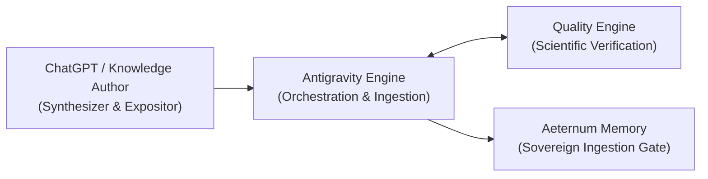
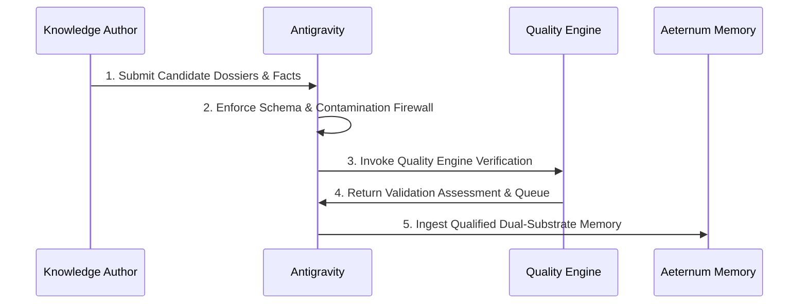

# AETERNUM KNOWLEDGE AUTHORING PROTOCOL — AKAP 1.0
**Architectural Governance Specification**  
**Short Name:** `AKAP 1.0`  
**Governing Standard:** Aeternum Sovereign Anatomical Infrastructure  
**Companion Contract:** `AACM 1.0` (Aeternum Anatomical Cognitive Model)  
**Status:** PERMANENT RATIFIED GOVERNANCE  

---

## 1. Executive Summary & Purpose

The **Aeternum Knowledge Authoring Protocol (AKAP 1.0)** establishes strict, inviolable boundaries and role separation across the entire anatomical knowledge lifecycle of Aeternum Atlas.

The central tenet of Aeternum knowledge sovereignty is that **no LLM owns canonical anatomical truth**. Generative models (e.g., ChatGPT, Claude, Gemini, or Ollama) act as skilled synthesizers, expositors, and authoring assistants, but the validation, schema enforcement, database custody, and deterministic memory belong unconditionally to Aeternum.

---

## 2. Role Separation & Boundary Contracts

### 2.1. CHATGPT / KNOWLEDGE AUTHOR
The **Knowledge Author** is the intellectual synthesizer and author of pedagogical content.

#### Responsibilities:
- **Anatomical Synthesis:** Translating complex, raw dissection, textbook, and surgical observations into coherent anatomical descriptions.
- **Detailed Academic Prose:** Composing rigorous, grammatically impeccable text in standard anatomical Portuguese (`pt-BR`) or Latin-aligned terminology.
- **Relational Explanation:** Unpacking syntopic relationships between bones, nerves, muscles, and vessels.
- **Macro Dossiers:** Assembling panoramic descriptions covering classification, morphology, surfaces, borders, angles, and processes.
- **Micro Fact Candidates:** Formulating atomic, falsifiable assertion candidates (O/I/A/I, articulations, boundaries).
- **Teaching Connections:** Proposing meaningful clinical, functional, or surgical associations that reflect professor logic.
- **Practical Anatomy Interpretation:** Articulating cadaveric prosection inspection cues, laterality determination tips, and surface landmarks.
- **Clinical-Context Candidates:** Proposing pathology, trauma, or clinical relevance candidates (e.g., nerve compression, fracture vulnerabilities).
- **Terminology Candidates:** Identifying synonyms, eponyms, and Latin terms (*Terminologia Anatomica*).
- **Knowledge-Gap Filling Proposals:** Highlighting areas where source material is incomplete or ambiguous.

#### Invariants & Prohibitions:
- **Never assigns canonical status:** The author produces *candidates* (`validation_status = SOURCE_EXTRACTED` or `REVIEW_PENDING`).
- **Never assigns database primary keys:** Database UUIDs and deterministic IDs are generated strictly by Antigravity.
- **Never commits directly to production/staging:** All output must pass through Antigravity schema enforcement and Quality Engine gates.

---

### 2.2. ANTIGRAVITY
**Antigravity** is the engineering runtime, guardian of data structures, and pipeline orchestrator.

#### Responsibilities:
- **Schema Enforcement:** Validating that every ingested object strictly obeys JSON schemas (`micro_fact_schema`, `teaching_connection_schema`, `macro_completeness_model`).
- **Deterministic IDs:** Generating stable, idempotent content-hash identifiers (e.g., `chunk_id`, `assertion_id`, `node_id`).
- **Provenance Storage:** Permanently binding every claim to its exact source, edition, page number, and SHA-256 digest (`MORGUE_PRACTICAL_ANATOMY`, `ACADEMIC_COMPENDIUM`).
- **Duplicate Detection:** Catching redundant claims or collision artifacts before admission.
- **Consistency Checks:** Ensuring cross-table integrity between entities, relations, landmarks, and 3D mesh nodes.
- **Terminology Matching:** Grounding extracted terms against the certified Terminology Registry (`knowledge_base/taxonomy/`).
- **Validation Queue Generation:** Generating audited queues for questionable, conflicting, or non-standard source claims without silently rewriting them.
- **Contamination Checks:** Executing strict firewall scanners against Quality Lab holdout suites (`scan_corpus_contamination.cjs`).
- **Corpus Building:** Compiling structured candidate packages into reproducible datasets.
- **Database Ingestion:** Managing transactional migrations and seed scripts.
- **SQLite / Supabase Parity:** Guaranteeing 100% row-count and search-probe parity between local offline mirror (`node:sqlite` FTS5) and cloud Staging (`Supabase PostgreSQL pg_trgm`).
- **Coverage Reports:** Quantifying dimension saturation and reporting transparent metrics.
- **Quality Engine Execution:** Orchestrating automated test suites and evaluation harnesses.

---

### 2.3. QUALITY ENGINE
The **Quality Engine** is the scientific auditor and certified verification gatekeeper.

#### Responsibilities:
- **Correctness Qualification:** Validating anatomical truth against high-tier compendiums (Latarjet, Testut, Gray, Moore, Netter).
- **Completeness Verification:** Measuring coverage across the 9/15 macro dimensions.
- **Terminology Certification:** Validating compliance with *Terminologia Anatomica (TA2)*.
- **Relation Verification:** Confirming topological and spatial feasibility of claimed relations.
- **Topographic Consistency:** Verifying that spatial boundaries, walls, floors, and roofs enclose claimed contents.
- **Contradiction Detection:** Flagging conflicting statements between sources or internal slips within a single source.
- **False Premise Resistance:** Ensuring the system rejects false premises (e.g., "Qual nervo inerva o bíceps via nervo radial?").
- **Validation Gates:** Deciding qualification transitions:
  $$\text{SOURCE\_EXTRACTED} \longrightarrow \text{REVIEW\_PENDING} \longrightarrow \text{SUPPORTED} \longrightarrow \text{VALIDATED} \mid \text{CONFLICTING} \mid \text{REJECTED}$$

---

### 2.4. AETERNUM MEMORY
**Aeternum Sovereign Memory** is the permanent canonical repository of validated anatomical knowledge.

#### Mandatory Record Attributes:
Every record admitted into Aeternum Memory **must** carry the following six dimensions without exception:

1. **Source Identity (`source_identity`):** Exact source ID, author, work title, publication year, edition, and page/section number.
2. **Authoring Identity (`authoring_identity`):** Identification of authoring agent, pipeline version, and ingestion timestamp.
3. **Validation State (`validation_state`):** Strict qualification status (`VALIDATED`, `SUPPORTED`, `SOURCE_EXTRACTED`, `REVIEW_PENDING`, `CONFLICTING`).
4. **Corpus Version (`corpus_version`):** Canonical version tag (e.g., `AAC-2026.1-R1`, `AAC-2026.2`).
5. **Entity Identity (`entity_identity`):** Canonical normalized entity ID anchored in the taxonomy registry.
6. **Semantic Dimensions (`semantic_dimensions`):** Domain classification, functional compartment, syntactic relation family, and pedagogical layer.

> **Admission Rule:** Bare text or unannotated claims lacking any of the 6 mandatory attributes are **strictly rejected** at the memory ingestion boundary.

---

## 3. The Five-Stage Authoring Lifecycle

1. **Candidate Generation (Knowledge Author):** Produces rich prose, relational facts, and teaching connections.
2. **Structural Normalization (Antigravity):** Enforces schemas, generates deterministic IDs, checks duplicates, and audits against test suite leaks.
3. **Scientific Verification (Quality Engine):** Qualifies correctness, verifies topography, and generates the Validation Queue.
4. **Dual-Substrate Build (Antigravity):** Builds SQLite local mirror and Supabase staging table with verified parity.
5. **Memory Admission (Aeternum Memory):** Permanently commits verified records with complete 6-attribute provenance metadata.

---

## 4. Golden Invariants

1. **No Silent Promotion:** No authoring draft or institutional note may be promoted to canonical truth without passing through Quality Engine validation.
2. **Provenance Isolation:** Source notes must never be silently merged with canonical compendiums. Each source maintains its independent identity.
3. **Preservation of Source Errors:** Discrepancies or slips in historical or student notes must remain documented as `CONFLICTING` rather than silently corrected.
4. **Dual-Substrate Parity:** Online cloud retrieval (Supabase) and offline local retrieval (SQLite) must remain bit-for-bit semantically synchronized.
