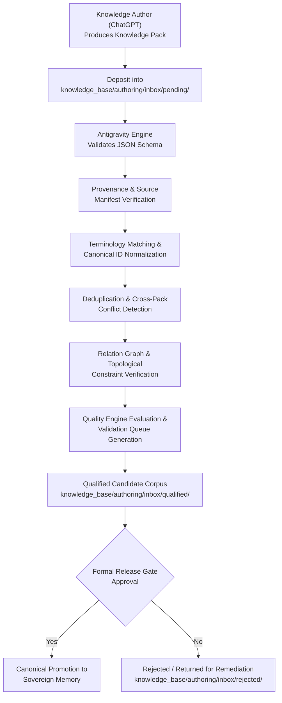

# AETERNUM KNOWLEDGE AUTHOR INGESTION PROTOCOL (AKAIP 1.0)
**Governing Frameworks:** `AACM 1.0` (Aeternum Anatomical Cognitive Model) & `AKAP 1.0` (Aeternum Knowledge Authoring Protocol)  
**Contract Version:** `1.0.0`  
**Classification:** Architectural Governance Contract  

---

## 1. Executive Intent & Architecture
This protocol formalizes the engineering and pedagogical boundary between external knowledge synthesis (performed by the **Aeternum Knowledge Author** via OpenAI ChatGPT) and deterministic system orchestration (governed by the **Antigravity Engine** and verified by the **Quality Engine**).

To guarantee sovereign academic integrity, Aeternum enforces strict separation between:
1. **Source Material:** Raw bibliographic and cadaveric teaching assets.
2. **Source-Extracted Assertions:** Verbatim statements extracted from specific source pages.
3. **Knowledge Author Content:** Pedagogical syntheses, macro dossiers, and candidate facts created by ChatGPT.
4. **Canonical Evidence:** Primary and secondary anatomical literature with registered manifest entries.
5. **Validation Assessments:** Explicit evaluation records linking claims to evidence.
6. **Canonical Aeternum Memory:** The verified, immutable sovereign knowledge store.

---

## 2. Canonical Source vs. Corpus Version
A fundamental architectural invariant is the distinction between a bibliographic source and a corpus build:
- **`SOURCE_ID`:** An authorized, registered anatomical text, terminology standard, or institutional material (e.g. *Terminologia Anatomica 2*, *Moore Clinically Oriented Anatomy*, *Gray's Anatomy*, *Latarjet-Testut*).
- **`CORPUS_VERSION`:** A specific compilation or snapshot release of Aeternum's database (e.g. `AAC-2026.1-R1`).

> [!CAUTION]
> **Anti-Self-Reference Rule:** An Aeternum corpus version (`AAC-2026.1-R1`) is an engineering build artifact, **NOT** independent bibliographic evidence. Under no circumstances may an atomic proposition be marked as `VALIDATED` solely because it was found in an Aeternum corpus build. Every canonical validation must trace directly to a registered `SOURCE_ID` manifest entry.

---

## 3. Validation Authority Model
Source authority is defined independently of any individual fact's validation state:

| Authority Class | Tier Level | Scope & Description |
| :--- | :---: | :--- |
| **`CANONICAL_PRIMARY`** | Level 1 | International normative anatomical standards (*Terminologia Anatomica 2*, FIPAT). Definitive for systematic boundaries and terminology. |
| **`CANONICAL_SECONDARY`** | Level 2 | Standard international reference textbooks (*Gray's Anatomy*, *Moore*, *Netter*, *Latarjet*, *Testut*). Authoritative for descriptive morphology, syntopy, and relations. |
| **`INSTITUTIONAL_TEACHING`** | Level 3 | Cadaveric laboratory dissection guides, morgue handouts, and professor practical notes (e.g. `MORGUE-UPPER-LIMB-001`). Preserves practical teaching dynamics without silently altering canonical truth. |
| **`TERMINOLOGY_AUTHORITY`** | Level 1 | Official anatomical nomenclature registries (*IFAA*, *FIPAT*). Normative for Latin, English, and Portuguese anatomical synonyms and eponym retirement. |
| **`INTERNAL_CURATED`** | Level 4 | Peer-reviewed, multi-source validated Aeternum consensus dossiers. |
| **`AI_AUTHORED_DRAFT`** | Level 5 | Synthesized candidate proposals authored by ChatGPT pending formal ingestion. Never canonical on its own. |
| **`SYNTHETIC_QA`** | Level 6 | Synthetic evaluation test suites and regression probes. Strictly excluded from production memory. |

---

## 4. Knowledge Author Identity & Authoring Modes
External knowledge packs generated through ChatGPT must declare:
- **`authoring_agent`:** `OPENAI_CHATGPT_AETERNUM_KNOWLEDGE_AUTHOR`
- **`authoring_protocol`:** `AKAP-1.0`

### Authoring Modes
1. **`SOURCE_GROUNDED`:** Content derived directly from one approved, registered Aeternum source. Initial status: `SOURCE_GROUNDED_DRAFT`.
2. **`MULTI_SOURCE_SYNTHESIS`:** Content synthesizing multiple registered sources into a cohesive relational picture. Initial status: `SOURCE_GROUNDED_DRAFT`.
3. **`AI_DRAFT`:** Content proposed from expert intelligence without immediate registered source citation. Initial status: `AI_DRAFT`. Must never enter canonical memory directly.

---

## 5. Morgue + Canonical Duality
Practical cadaveric teaching and canonical textbook anatomy often present divergences, informal student mnemonics, or localized anatomical slips. Aeternum explicitly preserves both layers simultaneously:
- **`MORGUE_ASSERTION`:** Source = `MORGUE-UPPER-LIMB-001` (preserves professor teaching dynamics and slips).
- **`CANONICAL_FACT`:** Source = Canonical academic reference (e.g. *Moore*, *TA2*).

Duality relationships are explicitly tracked:
- `AGREE`
- `PARTIALLY_AGREE`
- `CONFLICT`
- `USE_DIFFERENT_TERMINOLOGY`

Neither layer may overwrite or erase the other.

---

## 6. Canonical Validation Contract
An atomic proposition can achieve `VALIDATED` status if and only if all six conditions are satisfied:
1. **Explicit Lineage:** Pointers down to specific source, chapter, and page/figure.
2. **Registered Source:** Source ID exists in `aeternum_anatomical_corpus_manifest.json`.
3. **Authorized Usage:** Source tier permits canonical qualification.
4. **Exact Proposition Match:** Evidence substantiates the specific atomic subject-predicate-object claim.
5. **No Unresolved Conflict:** No unaddressed contradiction exists with a higher-authority standard.
6. **Explicit Assessment:** A deterministic `VALIDATION_ASSESSMENT` record exists.

---

## 7. Knowledge Author → Antigravity Handshake

---

## 8. Anti-Hallucination Role Invariant
> [!IMPORTANT]
> **ANTIGRAVITY MUST NOT AUTHOR MISSING ANATOMICAL KNOWLEDGE.**
> When an anatomical gap, missing dimension, or incomplete evidence is detected during ingestion or retrieval, Antigravity **must** emit a `KNOWLEDGE_GAP_REQUEST` or flag `MISSING_KNOWLEDGE`.
> Under no circumstances may Antigravity attempt to synthesize, guess, or invent missing anatomical facts using LLM parameters to satisfy a validation test.
