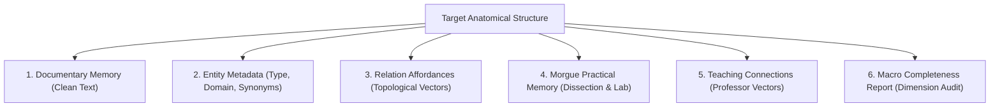

# AETERNUM ATLAS — CORPUS AUTHORING & EXPANSION GUIDE (AACM COMPLIANT)
**Specification:** AACM 1.0 Corpus Authoring Protocol  
**Applies to:** Future Phase `LOCAL-L3-R3C` (Extreme Anatomical Memory Expansion) and ongoing memory curation  

---

## 1. Core Mandate: Memory Beyond Raw Chunks

Under the **Aeternum Anatomical Cognitive Model (AACM)**, corpus authoring is **never** a simple collection of unstructured text passages. 

For every anatomical structure introduced or expanded, the authoring pipeline must construct an interconnected **Cognitive Entity Dossier** comprising six essential pillars:

---

## 2. The Six Pillars of Authoring

### Pillar 1: Documentary Memory
- Clean, objective, high-tier textbook descriptive prose in Portuguese (`pt-BR`).
- Standardized anatomical terminology grounded in Terminologia Anatomica (TA2).
- Zero conversational noise, zero prompt-leak phrases, and zero direct copies of benchmark test items.
- Strict provenance tracking (`source_id`, `source_file`, `source_sha256`, `page_number`, `tier`).

### Pillar 2: Entity Metadata
- Complete metadata tagging including `domain`, `subdomain`, `topic`, `structures`, and `knowledge_dimensions`.
- Canonical mapping to the base Terminology Registry (`canonical_id`).

### Pillar 3: Relation Affordances
- Declaration of supported relational families:
  - `passes_between`
  - `lies_between`
  - `originates_from`
  - `inserts_into`
  - `innervated_by`
  - `innervates`
  - `supplied_by`
  - `articulates_with`
  - `branches_from`
  - `drains_into`
  - `formed_by_components`

### Pillar 4: Morgue Practical Memory
- Practical cadaveric prosection identification tips.
- Palpatory landmarks and surface anatomy guidelines.
- Structural differences visible in embalmed tissues (e.g., nerve vs. tendon vs. valved vein).
- Surgical and dissection boundary planes.

### Pillar 5: Teaching Connections
- Pedagogical bridges connecting bony landmarks, nerves, vascular bundles, muscular compartments, and spaces.
- Explicit `teaching_reason` establishing clinical or functional relevance.

### Pillar 6: Macro Completeness Audit
- Pre-ingestion completeness audit across the 9 macro dimensions:
  1. `MORPHOLOGY`
  2. `ARTICULATIONS`
  3. `MUSCULAR_RELATIONS`
  4. `NEURAL_RELATIONS`
  5. `VASCULAR_RELATIONS`
  6. `TOPOGRAPHY`
  7. `PRACTICAL_IDENTIFICATION`
  8. `CLINICAL`
  9. `3D_MAPPING`

---

## 3. Pre-Ingestion Integrity Gates

Before any new chunk is admitted to the sovereign memory or database:
1. **Contamination Firewall Scan**: Must execute `scan_corpus_contamination.cjs` and confirm zero leaks against test assets.
2. **Semantic Provenance Audit**: Must confirm generator scripts do not read benchmark gold files.
3. **Dual-Substrate Build**: Must build concurrently into both Local SQLite FTS5 (`aeternum_anatomical_memory.db`) and Supabase Staging (`vita_anatomical_knowledge`).
4. **Parity Check**: Row count and search probe parity must be verified at 100%.

---

## 4. Role Separation Under AKAP 1.0

Authoring and admission must follow the strict role separation defined in [`AETERNUM_KNOWLEDGE_AUTHORING_PROTOCOL.md`](AETERNUM_KNOWLEDGE_AUTHORING_PROTOCOL.md):
- **ChatGPT / Knowledge Author:** Produces pedagogical synthesis, prose, dossiers, and candidates.
- **Antigravity Engine:** Enforces schemas, generates deterministic IDs, manages dual-substrate builds, and guards provenance.
- **Quality Engine:** Qualifies correctness, completeness, terminology, relations, and topography.
- **Aeternum Memory:** Admits only records carrying the 6 mandatory attributes (`source_identity`, `authoring_identity`, `validation_state`, `corpus_version`, `entity_identity`, `semantic_dimensions`).

