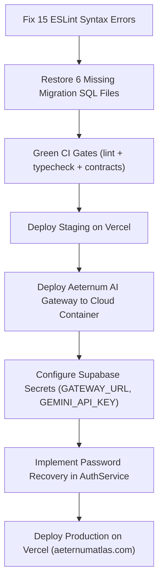

# AETERNUM ATLAS — VERCEL PRODUCTION RELEASE READINESS AUDIT (R1)

**Phase**: `AETERNUM-RELEASE-R1`  
**Date**: October 4, 2026  
**Auditor**: Antigravity (Knowledge Engineer / Release Readiness Auditor)  
**Author / Planner**: ChatGPT (Aeternum Anatomical Knowledge Author / Release Orchestrator)  
**Mode**: STRICT READ-ONLY AUDIT (Zero production code mutations, zero git commits, zero git pushes, zero deployments)  
**Repository**: `C:\Users\halis\.gemini\antigravity\scratch\aeternum-atlas-frontend`  
**Target Branch**: `antigravity/commercial-felipe-frontend`  
**Remote**: `https://github.com/halissonzanchin/aeternum-atlas.git`  

---

## 1. Executive Summary & Verdict

This read-only audit provides a rigorous, deterministic assessment of the current production readiness of the Aeternum Atlas platform to determine the shortest safe path from the current repository state to a live Vercel production deployment (`https://aeternumatlas.com`, `https://www.aeternumatlas.com`, `https://aeternum-atlas.vercel.app`).

### The Core Finding
The core visual, educational, 3D navigation, quiz, and multi-tenant governance platform is **exceptionally robust and production-viable today**:
1. **Frontend Compilation**: `vite build` builds 849 modules cleanly into `dist/` in 7.41 seconds without error.
2. **Type Safety**: TypeScript (`tsc --noEmit`) passes with **0 errors**.
3. **Core Student & Academic Experience**: The 3D model catalog, interactive 3D viewer (Sketchfab embeds), 3 comprehensive theoretical quizzes, spaced-repetition flashcards (SM-2), study agenda, modular mural, rector dashboard, coordinator dashboard, and super admin CMS are **100% operational** with real telemetry and honest fallback states.
4. **Security & Zero Leaks**: Zero production secrets or service role keys are committed in tracked Git source code. All institutional access gating is enforced.

### The Critical Blockers (P0)
1. **P0-1: Atlas AI Tutor Fails Closed in Cloud (503 AI_GATEWAY_UNAVAILABLE)**.  
   The Edge Function (`supabase/functions/ai-tutor/index.ts`, lines 905–912) mandates a connection to `AETERNUM_AI_GATEWAY_URL`. Currently, this gateway is a local Node.js process listening on `http://127.0.0.1:8081` bound to Halissons local Windows workstation and Ollama (`qwen2.5:3b`). In a pure Vercel serverless environment, the tutor fails closed with an HTTP 503 error unless an external cloud gateway or direct cloud LLM fallback is configured.
2. **P0-2: ESLint Gate Failure (15 syntax/lint errors in working tree)**.  
   While Vite compiles the code, running `npm run lint` fails with 15 errors (duplicate keys in translation files `de.js`, `en.js`, `es.js`, `pt.js`; unescaped quote in `aeternumBehaviorOrchestrator.js`; empty catch blocks). Standard CI/CD release pipelines will abort on this gate.

---

## 2. Answers to the 10 Core Release Questions

### Q1: What is already production-ready?
- **Authentication**: Email/password login, registration with tenant validation, session restoration via `supabase.auth.getUser()`, role-based access control (`student`, `teacher`, `coordinator`, `rector`, `institution_admin`, `super_admin`).
- **Student Dashboard**: Live telemetry aggregation, study time, active models, recent models, learning evolution panel, and strategic progress radar.
- **3D Catalog & Viewer**: Integration with 3 canonical Sketchfab models (`corte-sagital-cranio-humano-superficial`, `corte-sagital-sistema-reprodutor-feminino`, `coracao-edicao-morgue`), topbar navigation, anatomical breadcrumbs, anatomical and theoretical quiz launches.
- **Quizzes**: 3 exhaustive theoretical examinations (Neuroanatomy, Heart Morphology, Female Reproductive Anatomy) with multiple question types, automated grading, and telemetry persistence.
- **Governance & Admin**: Rector Dashboard, Coordinator Dashboard, Institutional Student Management, 3D Model CMS, and Audit Logging.
- **Visual Design System**: Dual Dark and Light Liquid Glass system (A26) with zero overflow and responsive mobile support.

### Q2: What still uses mock data?
- **Password Recovery**: `src/pages/login/Login.jsx` triggers a toast saying "Fluxo de recuperacao preparado para API futura" instead of sending an email via `supabase.auth.resetPasswordForEmail`.
- **Model Thumbnails**: `src/data/localModels.js` has empty thumbnail and cover image URLs, falling back to procedural glyph rings.
- **Abandoned Analytics Hooks**: `useRealtimeGlobalAnalytics.js` and `useRealtimeStudentGrowth.js` contain `Math.random` mock generators, but they are **completely orphaned** and unreferenced by the UI.

### Q3: What is partially implemented?
- **Anatomical Flashcards**: The SM-2 spaced repetition algorithm, curated card bank, and study scheduling are fully functional, but state is persisted in client-side `window.localStorage` rather than synchronized to Supabase tables.
- **Study Agenda**: Calendar and hourly task grids are functional with local persistence, but multi-device cloud synchronization is pending.
- **User Profile**: Users can update their name and password, but fields like course and semester are not saved to `public.users` on submit.
- **Interactive Lessons**: The sandbox iframe player runs smoothly, but only 1 verified lesson manifest exists in the library.

### Q4: What is broken?
- **Atlas AI Tutor in Vercel Cloud**: Serverless Edge Function cannot reach the local machine (:8081) and throws 503 `AI_GATEWAY_UNAVAILABLE`.
- **Aeternum Vita Voice**: Requires a LiveKit WebRTC server and local speech engines (`SpeachesSTTProvider`/`SpeachesTTSProvider`), which cannot run in Vercel.
- **Contract Test Suite**: 5 contract tests fail due to missing historical SQL files in `supabase/migrations/`.

### Q5: What is missing?
- **Public Cloud Gateway**: A cloud-hosted container running `packages/aeternum-vita/apps/gateway` with Gemini 3.7 Flash fallback.
- **Safe Engine Web Endpoint**: The deterministic Safe Engine (0.2.0) is not compiled for browser execution or exposed via an Edge Function.
- **Canonical Memory Cloud Sync**: The 248 canonical facts and 154 entities are in SQLite/JSON locally, not yet synced to Supabase production tables.
- **B2C Self-Serve Payment**: No Stripe/Pix checkout exists; licensing is exclusively B2B institutional.

### Q6: What blocks Vercel deployment?
- **P0-1** (AI Gateway Cloud Connectivity) and **P0-2** (ESLint CI Failure).

### Q7: What can safely ship now?
- The entire Core Academic Platform (Auth, Dashboard, 3D Catalog, 3D Viewer, Quizzes, Flashcards, Agenda, Modular Wall, Taxonomy, Governance Dashboards, and CMS).

### Q8: What should remain behind feature flags or excluded from release?
- **Aeternum Vita Voice**: Set `VITE_AETERNUM_VITA_PIPELINE=off` until LiveKit cloud infra is provisioned.
- **AI Tutor Live Chat**: If a public gateway is not deployed prior to release, keep AI Tutor in standby mode (honest "Em atualizacao institucional" banner) rather than exposing a 503 error.
- **Secondary Placeholders**: Keep `/videos`, `/courses`, `/classes`, `/radiology` in their current honest `A26EmptyState` status.

### Q9: What is the minimum remediation required before staging?
1. Fix 15 ESLint errors in translation files and services to green the build/lint gate.
2. Configure `VITE_SUPABASE_URL` and `VITE_SUPABASE_ANON_KEY` in Staging environment.
3. Stub or restore the 6 expected historical SQL files in `supabase/migrations/` so contract tests pass 100%.

### Q10: What is the minimum remediation required before production?
1. All Staging remediations.
2. Deploy the AI Gateway to a cloud host (or configure direct Gemini fallback in the Edge Function) and set `AETERNUM_AI_GATEWAY_URL` and `AETERNUM_AI_GATEWAY_TOKEN` in Supabase secrets.
3. Wire real `supabase.auth.resetPasswordForEmail` for password recovery.
4. Populate thumbnails in `src/data/localModels.js`.

---

## 3. Comprehensive Domain Audits

### Domain A: Frontend
- **Routing**: Centralized in `src/App.jsx` with strict role-based route protection (`ProtectedRoute`).
- **Pages**: 26 distinct page modules.
- **UX Integrity**: Graceful error boundary (`GlobalErrorBoundary`) and honest empty states (`A26EmptyState`) throughout. No broken imports or fatal runtime crashes detected.

### Domain B: Supabase
- **Authentication**: Fully real via Supabase Auth and synced with `public.users` multi-tenant RLS.
- **Tenancy**: Multi-tenant isolation enforced by `institution_id` filtering.
- **Projects**:
  - Production Ref: `hyivyrietgjdazgizafp`
  - Staging Ref: `hutohshswppahipgcwio`
- **Database Status**: Telemetry, user profiles, model metadata, and analytics events are live in Supabase.

### Domain C: Atlas IA & AI Gateway
- **Architecture**:
  `Browser -> Supabase Edge Function (/functions/v1/ai-tutor) -> Aeternum AI Gateway (:8081) -> Ollama (qwen2.5:3b) / Gemini`
- **Local Dependency**: Critical flaw identified. In `supabase/functions/ai-tutor/index.ts`, the Edge Function requires `AETERNUM_AI_GATEWAY_URL`. When absent, it deletes the user message and returns 503.
- **Safe Engine Availability**: Safe Engine is strictly offline in Node.js and not callable by the frontend.

### Domain D: Anatomical Memory
- **Protected State**:
  - Canonical Facts: **248**
  - Canonical Entities: **154**
  - Safe Engine Facts: **231**
  - Active Manifest: `AETERNUM-CANONICAL-MEMORY-0.2.2` (`knowledge_base/canonical/AETERNUM_CANONICAL_MEMORY_CURRENT.json`)
- **B2 Quarantine**: The 41 authored B2 facts (from P01 and P02) and 10 author holds are strictly isolated in `knowledge_base/authoring/` and are **not exposed** to production.

### Domain E: 3D Library
- **Provider**: Sketchfab Iframe API.
- **Canonical Models**:
  1. `corte-sagital-cranio-humano-superficial` (`0145e302fd94453c8f7fb2817e45060e`)
  2. `corte-sagital-sistema-reprodutor-feminino` (`1c8dbfa7ba8846afa3b4ef058df36753`)
  3. `coracao-edicao-morgue` (`d527b406b0dc430e888d0d016c02528a`)
- **Integrity**: Embed URLs are verified and live on Sketchfab. Native GLB viewer is disabled in favor of stable Sketchfab embeds.

### Domain F: Authentication
- **Flow**: Signup -> Pending State -> Admin Approval -> Active State -> Login -> Session Restore.
- **Bypass**: Zero mock identity bypasses detected; all authenticated paths require valid JWT.
- **Defect**: Password recovery lacks backend dispatch.

### Domain G: Commercial Access
- **Model**: Enterprise B2B University Licensing.
- **Entitlements**: User must belong to an active institution.
- **Checkout**: Self-serve checkout is not implemented and not required for university launch.

### Domain H: Security & Secrets
- **Tracked Code**: `SECRET_PRESENT=NO`. Zero private API keys, service role keys, or database credentials are committed in Git.
- **Environment**: `.env.local` is correctly gitignored.

### Domain I: Vercel Configuration
- **File**: `vercel.json` specifies single-page app rewrite:
  ```json
  {
    "rewrites": [
      {
        "source": "/(.*)",
        "destination": "/index.html"
      }
    ]
  }
  ```
- **Build Settings**: Vite preset, build command `npm run build`, output directory `dist`.
- **Domains**: `aeternumatlas.com`, `www.aeternumatlas.com`, `aeternum-atlas.vercel.app`.

### Domain J: Build & Verification
- `npm run build`: **SUCCESS** (Exit 0)
- `npm run typecheck`: **SUCCESS** (Exit 0)
- `npm run lint`: **FAILED** (Exit 1 - 15 errors, 449 warnings)
- `npm run test:contracts`: **95 PASS / 5 FAIL** (missing migration files)

---

## 4. Production Architecture Snapshot

```
+-----------------------------------------------------------------------------+
|                            Browser (End User)                               |
+-----------------------------------------------------------------------------+
                                       |
                                       v
+-----------------------------------------------------------------------------+
|                     Vercel Frontend (SPA - React 18)                        |
|   - Models Catalog [READY]             - 3D Viewer [READY]                  |
|   - Quizzes & Evaluation [READY]       - Flashcards / SM-2 [LOCAL_ONLY]     |
|   - Study Agenda [LOCAL_ONLY]          - Modular Wall [LOCAL_ONLY]          |
|   - Governance & CMS [READY]           - Dual Liquid Glass A26 [READY]      |
+-----------------------------------------------------------------------------+
             |                                             |
             v (Auth / CRUD / RLS)                         v (AI Chat)
+------------------------------------+    +------------------------------------+
|       Supabase Cloud (Prod)        |    |       Supabase Edge Function       |
|      [hyivyrietgjdazgizafp]        |    |              ai-tutor              |
|   - Auth & Users [READY]           |    |   - JWT & RLS Gate [READY]         |
|   - Models 3D Metadata [READY]     |    |   - RAG (Textbooks FTS) [READY]    |
|   - Telemetry & Events [READY]     |    |   - Gateway Delegation [BLOCKED]   |
+------------------------------------+    +------------------------------------+
                                                           |
                                                           v
                                          +------------------------------------+
                                          |        Aeternum AI Gateway         |
                                          |   - Mode: cloud_only / hybrid      |
                                          |   - State: LOCAL_ONLY (:8081)      |
                                          |   - Primary: Ollama (qwen2.5:3b)   |
                                          |   - Fallback: Gemini 3.7 Flash     |
                                          +------------------------------------+
                                                           |
                                                           v
                                          +------------------------------------+
                                          |       Canonical Knowledge          |
                                          |   - Safe Engine: [LOCAL_ONLY]      |
                                          |   - Canonical Memory: [LOCAL_ONLY] |
                                          |   - B2 Propositions: [QUARANTINED] |
                                          +------------------------------------+
```

---

## 5. Release Strategy: Minimum Scope vs Full Scope

### Minimum Release Scope (Safe & Immediately Shippable)
1. **Core Features**: Authentication, Student Dashboard, 3D Catalog, 3D Viewer, Quizzes, Flashcards (local), Study Agenda (local), Modular Wall, Taxonomy, Governance (Rector/Coordinator), Admin Operations.
2. **Remediation**:
   - Fix 15 ESLint errors.
   - Configure Staging & Production Vercel environment variables (`VITE_SUPABASE_URL`, `VITE_SUPABASE_ANON_KEY`).
   - Implement Supabase password recovery.
   - Set AI Tutor to graceful standby mode or route through a cloud gateway.

### Full Current Feature Scope (Complete Vision)
Includes all minimum features plus:
- Live streaming AI Tutor with zero local dependency.
- LiveKit WebRTC Vita voice tutor.
- Full cloud synchronization for flashcards and agenda.
- Integrated Safe Engine reasoning directly in the browser.
- Synchronized Canonical Memory (248 facts) in production database tables.

---

## 6. Remediation Roadmap



Total Remediation Steps: **7 concise engineering steps**.
