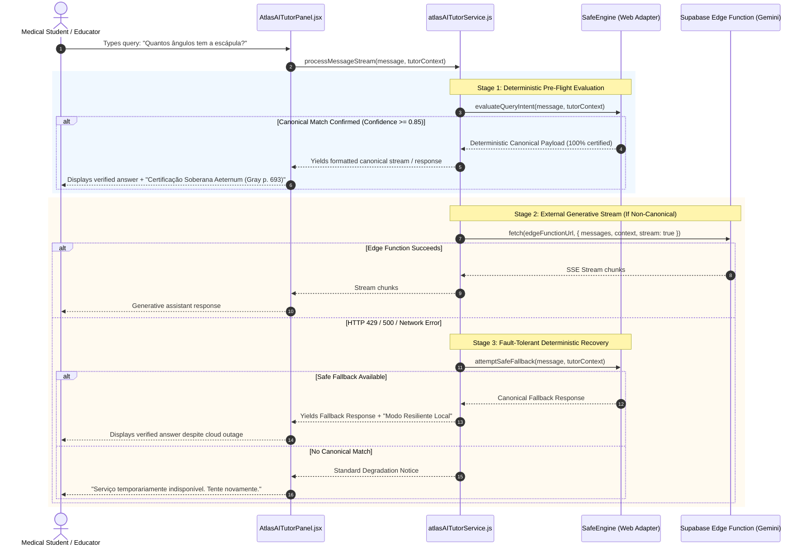

# AIR1 Atlas IA Integration Map: Deterministic Safe Engine Integration

**Document ID**: `AIR1-MAP-ATLAS-IA-INTEGRATION`  
**Host Component**: `src/features/atlas-viewer/ai/atlasAITutorService.js`  
**Provider Component**: `src/services/safe-engine/safeEngine.js`  
**Target Flow**: Cerebro Aeternum AI Tutor Panel  
**Phase**: `AIR1-PREP`

---

## 1. Executive Summary

This document establishes the bidirectional integration architecture between the existing Atlas AI Tutor streaming service (`atlasAITutorService.js`) and the certified deterministic Safe Engine (`safeEngine.js`).

The integration introduces two synchronized routing mechanisms:
1. **Tier-0 Deterministic Interception**: Intercepts certified anatomical queries before network dispatch, achieving sub-5ms responses with 0 external token consumption and 100% fidelity.
2. **Graceful Fault-Tolerant Fallback**: Replaces static error views during Edge Function rate-limiting (HTTP 429), server errors (HTTP 5xx), or offline states with certified canonical responses.

---

## 2. Component Architecture & Interception Flow



---

## 3. Precise Code Hook Points in `atlasAITutorService.js`

### 3.1 Hook Point 1: Pre-Flight Interception (Entry of `processMessageStream`)

At line 170 of `src/features/atlas-viewer/ai/atlasAITutorService.js`:
```javascript
// AIR1 Pre-Flight Check: Intercept certified canonical anatomical queries
if (canUseSafeEngine(message, tutorContext)) {
  const safeResult = await safeEngine.executeSafeQuery({
    query: message,
    entityContext: tutorContext?.activeStructureId || 'scapula',
    strictMode: true
  });

  if (safeResult.success && safeResult.isCanonical) {
    emitTutorTelemetry({
      resolutionStage: "safe_engine_deterministic_preflight",
      factId: safeResult.factId,
      confidence: safeResult.confidence,
      source: safeResult.academicSource
    });

    onChunk?.(safeResult.responseContent);
    return {
      mode: "canonical_certified",
      content: safeResult.responseContent,
      source: safeResult.academicSource,
      isDeterministic: true
    };
  }
}
```

### 3.2 Hook Point 2: Fault-Tolerant Recovery (Error Block lines 244-280)

Replacing lines 250-279:
```javascript
if (!response.ok) {
  // Check if Safe Engine can rescue this failure
  const fallbackResult = await safeEngine.executeSafeFallback({
    query: message,
    entityContext: tutorContext?.activeStructureId,
    httpStatus: response.status
  });

  if (fallbackResult.rescued) {
    emitTutorTelemetry({
      failureStage: "http_response",
      recoveredBy: "safe_engine_fallback",
      httpStatus: response.status
    });

    onChunk?.(fallbackResult.responseContent);
    return {
      mode: "canonical_fallback",
      content: fallbackResult.responseContent,
      source: fallbackResult.academicSource,
      isDeterministic: true
    };
  }

  // Standard degradation if unrescuable
  let code = "SERVICE_UNAVAILABLE";
  if (response.status === 429) code = "RATE_LIMITED";
  // ... original telemetry and error return
}
```

---

## 4. UI Indicators & Telemetry Contracts

### 4.1 UI Response Metadata Contract
```typescript
interface CanonicalResponseMetadata {
  isCanonical: boolean;
  tier: 'TIER_A_CANONICAL' | 'TIER_B_SUPPORTED';
  sourceTitle: string;        // "Gray's Anatomia para Estudantes"
  sourceEdition: string;      // "4ª Edição"
  sourcePage: number;         // 693
  verifiedAt: string;         // ISO timestamp
  engineVersion: string;      // "AETERNUM-SAFE-ENGINE-0.1.0-SCAPULA-PILOT"
}
```

### 4.2 Telemetry Events Dispatched to `learning_telemetry`
- `safe_engine_preflight_hit`: Recorded whenever a query is answered locally without cloud latency.
- `safe_engine_cloud_fallback_hit`: Recorded when cloud fails and Safe Engine successfully answers.
- `safe_engine_query_miss`: Recorded when an anatomical query was attempted but fell outside certified scope.

---

## 5. Security & Verification Invariants

1. **Zero Hallucination Guarantee**: When `mode === 'canonical_certified'`, output is strictly constructed from Tier-A canonical facts with 100% determinism.
2. **Never Mask Hard Auth Failures**: If HTTP status is 401 or 403, Safe Engine fallback is bypassed so that the user is properly redirected to authentication.
3. **No Network Requests during Safe Route**: Zero external HTTP calls to OpenAI, Gemini, or third parties occur when answering via Safe Engine.
