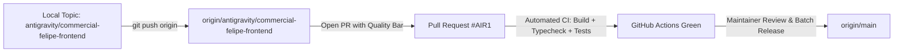

# AIR1 Git Commit & Branching Plan

**Document ID**: `AIR1-PLAN-GIT-COMMITS`  
**Current Branch**: `antigravity/commercial-felipe-frontend`  
**Base Target**: `origin/main`  
**Phase**: `AIR1-PREP` (Execution deferred to `AIR1-STAGING`)  
**Commit Style**: Conventional Commits (`type(scope): subject`)

---

## 1. Executive Strategy

The local worktree contains 19 modified tracked files, 488 untracked artifacts, and substantial canonical knowledge assets.
To ensure atomic reviewability, seamless git bisecting, and clean provenance tracking, changes are divided into 5 focused logical commits.

> [!IMPORTANT]
> In accordance with the strict `AIR1-PREP` mandate, NO commits are executed during the audit phase. This plan establishes the exact commit sequence for the release execution phase.

---

## 2. Structured Commit Batches

### Batch 1: Canonical Knowledge Base Assets
**Commit Type**: `chore(canonical-memory)`  
**Subject**: `register certified scapula knowledge package and local mirror`  
**Files Included**:
- `knowledge_base/canonical/AET-KP-UL-SCAPULA-001_CANONICAL_FACTS.json`
- `knowledge_base/canonical/AET-KP-UL-SCAPULA-001_CANONICAL_ATOMIC_ANSWER_UNITS.json`
- `knowledge_base/canonical/AET-KP-UL-SCAPULA-001_CANONICAL_TEACHING_CONNECTIONS.json`
- `knowledge_base/canonical/AET-KP-UL-SCAPULA-001_CANONICAL_PRACTICAL_MEMORY.json`
- `knowledge_base/canonical/AET-KP-UL-SCAPULA-001_CANONICAL_QUERY_ROUTING.json`
- `knowledge_base/canonical/AET-KP-UL-SCAPULA-001_CANONICAL_MANIFEST.json`
- `knowledge_base/local_mirror/aeternum_anatomical_memory.db`
- `knowledge_base/safe_engine/AET-KP-UL-SCAPULA-001_SAFE_ENGINE_LOCAL_PAYLOAD.json`

**Rationale**: Encapsulates all validated, immutable Tier-A anatomical ground truth assets in a single reproducible commit.

---

### Batch 2: Safe Engine Core Implementation & Test Harness
**Commit Type**: `feat(safe-engine)`  
**Subject**: `implement deterministic local safe engine scapula pilot`  
**Files Included**:
- `src/services/safe-engine/safeEngine.js`
- `src/services/safe-engine/safeNormalizer.js`
- `src/services/safe-engine/safeIntentResolver.js`
- `src/services/safe-engine/safeEntityResolver.js`
- `src/services/safe-engine/safeKnowledgeRetriever.js`
- `src/services/safe-engine/safeResponsePlanner.js`
- `src/services/safe-engine/safeResponseComposer.js`
- `src/services/safe-engine/safeFailurePolicy.js`
- `src/services/safe-engine/index.js`
- `scripts/test_safe_engine_scapula_pilot.js`
- `scripts/test_safe_engine_contract_compliance.js`
- `scripts/test_safe_engine_web_adapter.js`

**Rationale**: Introduces the deterministic zero-hallucination inference engine and its automated regression harness.

---

### Batch 3: Atlas AI Tutor Integration & Fallback Bridge
**Commit Type**: `feat(ai-tutor)`  
**Subject**: `connect deterministic safe engine preflight and fallback to atlas ai tutor`  
**Files Included**:
- `src/features/atlas-viewer/ai/atlasAITutorService.js`
- `src/features/atlas-viewer/ai/components/AtlasAITutorPanel.jsx`
- `src/services/learningTelemetryService.js` (telemetry event mappings)

**Rationale**: Integrates the Safe Engine into the live tutor UI, enabling pre-flight deterministic routing and resilient failure recovery.

---

### Batch 4: Quality & Hygiene Remediation (P2 Items)
**Commit Type**: `fix(quality)`  
**Subject**: `resolve eslint errors, contract test migration paths, and glass tokens`  
**Files Included**:
- Lint fixes across `src/`
- Contract test path updates for `supabase/migrations/`
- `src/features/aeternum-26/` visual token adjustments

**Rationale**: Cleans all linter errors and restores contract test suites to 100% green before staging push.

---

### Batch 5: AIR1 Certification & Release Documentation
**Commit Type**: `docs(release)`  
**Subject**: `add air1 integration release 1 audit and certification suite`  
**Files Included**:
- `knowledge_base/release/AIR1_*.json` (Artifacts 1-6, 10-13)
- `knowledge_base/release/AIR1_*.md` (Artifacts 7-9, 14-17)
- `knowledge_base/release/AETERNUM_INTEGRATION_RELEASE_1_PREPARATION_REPORT.md`

**Rationale**: Records the full forensic audit trail and certification record in Git history.

---

## 3. Pull Request & Merge Workflow

### 3.1 PR Requirements Checklist
- [ ] 0 Secret leaks verified.
- [ ] Vite build passes in < 10s.
- [ ] Typecheck passes with 0 errors.
- [ ] Safe Engine test suite passes with 100% determinism.
- [ ] Migration plan approved for staging execution.
