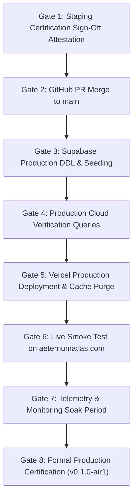

# AIR1 Production Release Execution Plan

**Document ID**: `AIR1-PLAN-PROD-RELEASE`  
**Phase**: `AIR1-PROD`  
**Target Backend**: Supabase Production (`hyivyrietgjdazgizafp`, `sa-east-1`)  
**Target Web Domains**: `aeternumatlas.com`, `www.aeternumatlas.com`  
**Hosting Provider**: Vercel (`prj_H1xE1yVLWhl5AlLoHuOxoz0QQbHh`)  
**Safety Classification**: Zero-Downtime Sovereign Production Release

---

## 1. Executive Summary

This plan defines the controlled, audited promotion of Aeternum Integration Release 1 into the live production environment.
The release introduces Aeternum Sovereign Canonical Memory and the Deterministic Safe Engine (Scapula Pilot) to all active users on `aeternumatlas.com`.

---

## 2. Hard Prerequisites for Production Gate Clearance

No action in this plan may proceed without satisfying all prerequisite conditions:
1. **Staging Certification**: `AIR1_STAGING_EXECUTION_REPORT.md` certified with 100% test pass rate.
2. **Zero P0 / P1 Blockers**: All critical and staging blockers verified resolved.
3. **Approved Change Window**: Scheduled low-traffic maintenance window (e.g., 03:00 - 05:00 UTC).
4. **Active Snapshot / Backup**: Point-in-Time Recovery (PITR) verified active on Supabase Production.

---

## 3. Production Deployment Gates



---

## 4. Operational Step-by-Step Procedure

### Gate 1: Staging Attestation
Verify staging report checksum and confirm zero regressions across all 12 platform modules.

### Gate 2: PR Merge into `main`
1. Pull request reviewed and approved according to repository maintainer guidelines.
2. Merge PR into `origin/main` via fast-forward or squash merge.
3. Local checkout of `main` updated:
   ```bash
   git checkout main && git pull origin main
   ```

### Gate 3: Supabase Production DDL & Seeding
1. Connect to Production database (`hyivyrietgjdazgizafp`).
2. Verify baseline: 56 existing tables (46 core + 10 Vita research).
3. Apply migration `20260925000000_create_canonical_memory_tables.sql`.
   - New table count: 66 tables.
   - All 10 canonical tables receive RLS with public SELECT and service_role write.
4. Apply migration `20260925000001_seed_scapula_canonical_memory.sql`.
   - 119 facts, 113 relations, 11 teaching connections, 6 practical units, 88 routing variants.

### Gate 4: Production Cloud Verification
Execute non-mutating SQL read verification:
```sql
SELECT 
    (SELECT count(*) FROM public.canonical_facts WHERE safe_engine_production_eligible = true) AS facts_ready,
    (SELECT count(*) FROM public.canonical_relations WHERE relation_safety_certified = true) AS relations_ready,
    (SELECT count(*) FROM public.canonical_teaching_connections) AS connections_ready,
    (SELECT count(*) FROM public.canonical_practical_memory) AS practical_ready;
```
Expected: `119 | 113 | 11 | 6`. All foreign keys verified intact.

### Gate 5: Vercel Production Deployment
1. Trigger Vercel Production build from merged commit on `main`.
2. Confirm production build log:
   - Vite bundling completes in < 10 seconds.
   - Zero missing environment variable warnings.
   - Production bundle deployed to edge network.
3. Invalidate edge CDN cache for `/index.html` and assets.

### Gate 6: Live Smoke Test on `aeternumatlas.com`
Perform automated and manual verification on live URL:
1. **Core Features**:
   - User login and authentication session check.
   - 3D Viewer loads scapula model cleanly at 60 FPS.
   - Educational curriculum lessons load progress.
2. **Deterministic Safe Engine Verification**:
   - Query 1: "Qual a função do processo coracoide?" -> Returns Fact `F-SCAP-039` with Gray's citation.
   - Query 2: "Quantas faces possui a escápula?" -> Returns Fact `F-SCAP-002` with Gray's citation.
   - Verified Badge: UI renders "Certificação Soberana Aeternum".

### Gate 7: Telemetry & Monitoring Soak Period
1. Monitor Sentry / Error Reporting for 30 minutes.
2. Confirm error rate <= 0.01%.
3. Confirm `safe_engine_preflight_hit` telemetry events are recording in `learning_telemetry`.

### Gate 8: Formal Certification & Tagging
1. Create Git annotated tag:
   ```bash
   git tag -a v0.1.0-air1 -m "Release AIR1: Sovereign Canonical Memory & Safe Engine Scapula Pilot"
   git push origin v0.1.0-air1
   ```
2. Archive `AETERNUM_INTEGRATION_RELEASE_1_PRODUCTION_REPORT.md`.

---

## 5. Rollback Thresholds
Immediate rollback to previous stable commit is triggered if:
- Error rate on `aeternumatlas.com` exceeds 1% over a 5-minute window.
- 3D Viewer fails to initialize for authenticated users.
- Authentication or license validation crashes.
- Any regression detected in student lesson progress recording.
