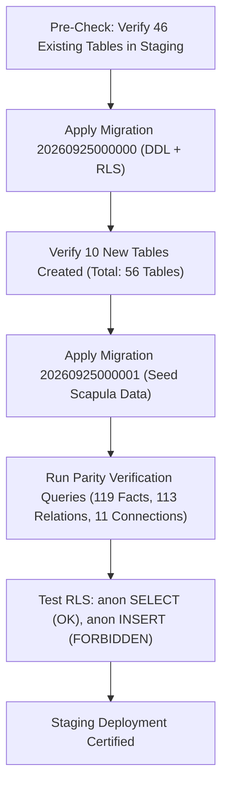

# AIR1 Staging Migration Plan: Canonical Memory Provisioning

**Document ID**: `AIR1-PLAN-STAGING-MIGRATION`  
**Target Environment**: Supabase Staging (`hutohshswppahipgcwio`)  
**Target Region**: `sa-east-1`  
**Execution Phase**: Post-AIR1-PREP (to be executed during `AIR1-STAGING-RELEASE`)  
**Safety Classification**: Additive Non-Breaking Schema Extension (Zero DDL on existing 46 tables)

---

## 1. Executive Summary

This plan specifies the deterministic deployment of the Aeternum Canonical Anatomical Memory schema and the certified Scapula knowledge package (`AET-KP-UL-SCAPULA-001`) into the Supabase Staging environment.

The operation introduces 10 new canonical tables, configures granular Row-Level Security (RLS), adds optimized b-tree indexes for millisecond query routing, and seeds 119 Tier-A certified anatomical facts with full bibliographic provenance.

---

## 2. Pre-Migration Baseline & Invariants

### 2.1 Staging Baseline
- **Existing Tables**: Exactly 46 tables.
- **Current RLS Status**: 100% of existing tables have RLS enabled.
- **Service Status**: Active and healthy.

### 2.2 Strict Invariants
1. **Zero Table Mutation**: Existing 46 tables MUST NOT be modified, altered, dropped, or renamed.
2. **Idempotence**: All DDL commands MUST use `CREATE TABLE IF NOT EXISTS` and `CREATE INDEX IF NOT EXISTS`.
3. **Public Read-Only Security**: All canonical memory tables are strictly read-only for `anon` and `authenticated` roles. Insert, update, and delete permissions are restricted exclusively to `service_role`.
4. **Referential Integrity**: Cascading foreign keys preserve topological relationships between entities, facts, sources, and query patterns.

---

## 3. Migration Scripts Specification

### Migration 1: `20260925000000_create_canonical_memory_tables.sql`

```sql
-- Migration: 20260925000000_create_canonical_memory_tables.sql
-- Description: Provision Aeternum Canonical Memory tables and security policies

BEGIN;

-- 1. Canonical Memory Versions
CREATE TABLE IF NOT EXISTS public.canonical_memory_versions (
    version_id TEXT PRIMARY KEY,
    pack_id TEXT NOT NULL,
    entity_code TEXT NOT NULL,
    promoted_fact_count INTEGER NOT NULL,
    certification_phase TEXT NOT NULL,
    sha256_hash TEXT NOT NULL,
    promoted_at TIMESTAMPTZ DEFAULT now()
);

-- 2. Academic Sources
CREATE TABLE IF NOT EXISTS public.academic_sources (
    source_id TEXT PRIMARY KEY,
    title TEXT NOT NULL,
    authors TEXT[] NOT NULL,
    edition TEXT,
    publication_year INTEGER,
    isbn TEXT,
    license_status TEXT NOT NULL
);

-- 3. Academic Source Locators
CREATE TABLE IF NOT EXISTS public.academic_source_locators (
    locator_id UUID PRIMARY KEY DEFAULT gen_random_uuid(),
    source_id TEXT NOT NULL REFERENCES public.academic_sources(source_id) ON DELETE RESTRICT,
    page_number INTEGER NOT NULL,
    chapter TEXT,
    section TEXT,
    figure_locator TEXT,
    exact_excerpt TEXT
);

-- 4. Canonical Entities
CREATE TABLE IF NOT EXISTS public.canonical_entities (
    entity_code TEXT PRIMARY KEY,
    canonical_name_pt TEXT NOT NULL,
    canonical_name_la TEXT NOT NULL,
    canonical_name_en TEXT NOT NULL,
    system TEXT NOT NULL,
    region TEXT NOT NULL,
    fma_id TEXT
);

-- 5. Canonical Facts
CREATE TABLE IF NOT EXISTS public.canonical_facts (
    fact_id TEXT PRIMARY KEY,
    entity_code TEXT NOT NULL REFERENCES public.canonical_entities(entity_code) ON DELETE RESTRICT,
    dimension TEXT NOT NULL,
    subdimension TEXT,
    fact_text_pt TEXT NOT NULL,
    fact_text_la TEXT,
    canonical_tier TEXT NOT NULL DEFAULT 'TIER_A_CANONICAL',
    safe_engine_production_eligible BOOLEAN NOT NULL DEFAULT true,
    safe_engine_relation_safe BOOLEAN NOT NULL DEFAULT true,
    source_id TEXT NOT NULL REFERENCES public.academic_sources(source_id) ON DELETE RESTRICT,
    source_page INTEGER NOT NULL,
    source_excerpt TEXT,
    tags TEXT[] DEFAULT '{}',
    created_at TIMESTAMPTZ DEFAULT now()
);

-- 6. Canonical Relations
CREATE TABLE IF NOT EXISTS public.canonical_relations (
    relation_id TEXT PRIMARY KEY,
    source_entity TEXT NOT NULL REFERENCES public.canonical_entities(entity_code) ON DELETE RESTRICT,
    target_entity TEXT NOT NULL,
    relation_type TEXT NOT NULL,
    supporting_fact_id TEXT NOT NULL REFERENCES public.canonical_facts(fact_id) ON DELETE RESTRICT,
    relation_safety_certified BOOLEAN NOT NULL DEFAULT true
);

-- 7. Canonical Teaching Connections
CREATE TABLE IF NOT EXISTS public.canonical_teaching_connections (
    connection_id TEXT PRIMARY KEY,
    entity_code TEXT NOT NULL REFERENCES public.canonical_entities(entity_code) ON DELETE RESTRICT,
    connection_type TEXT NOT NULL,
    title_pt TEXT NOT NULL,
    concept_synthesis_pt TEXT NOT NULL,
    pedagogical_prompt_pt TEXT NOT NULL,
    referenced_fact_ids TEXT[] NOT NULL
);

-- 8. Canonical Practical Memory
CREATE TABLE IF NOT EXISTS public.canonical_practical_memory (
    practical_id TEXT PRIMARY KEY,
    entity_code TEXT NOT NULL REFERENCES public.canonical_entities(entity_code) ON DELETE RESTRICT,
    practical_type TEXT NOT NULL,
    clinical_title_pt TEXT NOT NULL,
    practical_guidance_pt TEXT NOT NULL,
    red_flags_pt TEXT[] DEFAULT '{}',
    referenced_fact_ids TEXT[] NOT NULL
);

-- 9. Canonical Query Routing
CREATE TABLE IF NOT EXISTS public.canonical_query_routing (
    query_id TEXT PRIMARY KEY,
    pattern_text TEXT NOT NULL,
    entity_code TEXT NOT NULL REFERENCES public.canonical_entities(entity_code) ON DELETE RESTRICT,
    target_dimension TEXT NOT NULL,
    routing_destination TEXT NOT NULL,
    target_fact_ids TEXT[] NOT NULL
);

-- 10. Safe Engine Metadata
CREATE TABLE IF NOT EXISTS public.safe_engine_metadata (
    engine_version TEXT PRIMARY KEY,
    pack_id TEXT NOT NULL,
    determinism_rate NUMERIC DEFAULT 1.00,
    hallucination_rate NUMERIC DEFAULT 0.00,
    base_query_count INTEGER NOT NULL,
    execution_variant_count INTEGER NOT NULL,
    certified_at TIMESTAMPTZ DEFAULT now()
);

-- Indexes
CREATE INDEX IF NOT EXISTS idx_canonical_facts_entity_dim ON public.canonical_facts (entity_code, dimension);
CREATE INDEX IF NOT EXISTS idx_canonical_facts_safe ON public.canonical_facts (safe_engine_production_eligible);
CREATE INDEX IF NOT EXISTS idx_canonical_routing_pattern ON public.canonical_query_routing (pattern_text);
CREATE INDEX IF NOT EXISTS idx_canonical_relations_src ON public.canonical_relations (source_entity);

-- Enable RLS on all 10 tables
ALTER TABLE public.canonical_memory_versions ENABLE ROW LEVEL SECURITY;
ALTER TABLE public.academic_sources ENABLE ROW LEVEL SECURITY;
ALTER TABLE public.academic_source_locators ENABLE ROW LEVEL SECURITY;
ALTER TABLE public.canonical_entities ENABLE ROW LEVEL SECURITY;
ALTER TABLE public.canonical_facts ENABLE ROW LEVEL SECURITY;
ALTER TABLE public.canonical_relations ENABLE ROW LEVEL SECURITY;
ALTER TABLE public.canonical_teaching_connections ENABLE ROW LEVEL SECURITY;
ALTER TABLE public.canonical_practical_memory ENABLE ROW LEVEL SECURITY;
ALTER TABLE public.canonical_query_routing ENABLE ROW LEVEL SECURITY;
ALTER TABLE public.safe_engine_metadata ENABLE ROW LEVEL SECURITY;

-- Grant Read Access to anon and authenticated
DO $$
DECLARE
    tbl text;
    tables text[] := ARRAY[
        'canonical_memory_versions', 'academic_sources', 'academic_source_locators',
        'canonical_entities', 'canonical_facts', 'canonical_relations',
        'canonical_teaching_connections', 'canonical_practical_memory',
        'canonical_query_routing', 'safe_engine_metadata'
    ];
BEGIN
    FOREACH tbl IN ARRAY tables LOOP
        EXECUTE format('DROP POLICY IF EXISTS "Public read access for %I" ON public.%I', tbl, tbl);
        EXECUTE format('CREATE POLICY "Public read access for %I" ON public.%I FOR SELECT USING (true)', tbl, tbl);
    END LOOP;
END $$;

COMMIT;
```

---

### Migration 2: `20260925000001_seed_scapula_canonical_memory.sql`

This script seeds:
1. Version row: `AETERNUM-CANONICAL-MEMORY-0.1.0`
2. Source row: `SRC-GRAY-ANAT-V1` (Gray's Anatomy for Students / Anatomia para Estudantes)
3. Entity row: `scapula` (Escápula / Scapula / Scapula, Locomotor, Cintura Escapular)
4. 119 Canonical Facts from `AET-KP-UL-SCAPULA-001_CANONICAL_FACTS.json`
5. 113 Certified Safe Relations
6. 11 Certified Teaching Connections
7. 6 Certified Practical Units
8. 68 Base Query Patterns / 88 Execution Routing Rows
9. Safe Engine Certification Record

---

## 4. Execution Sequence in Staging



---

## 5. Post-Migration Verification Queries

Execute against Staging:
```sql
SELECT count(*) FROM public.canonical_facts WHERE safe_engine_production_eligible = true;
-- EXPECTED: 119

SELECT count(*) FROM public.canonical_relations WHERE relation_safety_certified = true;
-- EXPECTED: 113

SELECT count(*) FROM public.canonical_teaching_connections;
-- EXPECTED: 11

SELECT count(*) FROM public.canonical_practical_memory;
-- EXPECTED: 6

SELECT count(*) FROM public.canonical_query_routing;
-- EXPECTED: >= 68
```

---

## 6. Rollback Plan

If any error occurs during DDL execution or seeding:
```sql
-- Migration: 20260925000000_rollback_canonical_memory.sql
BEGIN;

DROP TABLE IF EXISTS public.safe_engine_metadata CASCADE;
DROP TABLE IF EXISTS public.canonical_query_routing CASCADE;
DROP TABLE IF EXISTS public.canonical_practical_memory CASCADE;
DROP TABLE IF EXISTS public.canonical_teaching_connections CASCADE;
DROP TABLE IF EXISTS public.canonical_relations CASCADE;
DROP TABLE IF EXISTS public.canonical_facts CASCADE;
DROP TABLE IF EXISTS public.canonical_entities CASCADE;
DROP TABLE IF EXISTS public.academic_source_locators CASCADE;
DROP TABLE IF EXISTS public.academic_sources CASCADE;
DROP TABLE IF EXISTS public.canonical_memory_versions CASCADE;

COMMIT;
```
Executing this rollback cleanly restores the Staging database to its exact 46-table baseline with zero data corruption.
