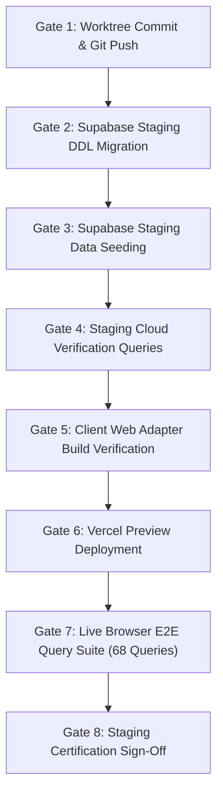

# AIR1 Staging Release Execution Plan

**Document ID**: `AIR1-PLAN-STAGING-RELEASE`  
**Phase**: `AIR1-STAGING` (Next immediate action after `AIR1-PREP`)  
**Target Backend**: Supabase Staging (`hutohshswppahipgcwio`, `sa-east-1`)  
**Target Web URL**: Vercel Preview (`aeternum-atlas.vercel.app`)  
**Primary Goal**: Live cloud and browser validation of Canonical Memory and the Safe Engine Scapula pilot.

---

## 1. Executive Summary

This plan outlines the operational procedure for deploying and validating Aeternum Integration Release 1 in the Staging environment.
Staging serves as the flight validation ground before any changes touch production. The deployment includes the cloud provisioning of 10 canonical memory tables, the browser-native Safe Engine web adapter, and end-to-end testing of the Atlas AI Tutor.

---

## 2. Release Gates & Execution Sequence



---

## 3. Detailed Operational Procedure

### Gate 1: Worktree Cleanliness & Remote Sync
1. Stage Batch 1 through Batch 5 as specified in `AIR1_GIT_COMMIT_PLAN.md`.
2. Push topic branch to remote:
   ```bash
   git push origin antigravity/commercial-felipe-frontend
   ```
3. Verify GitHub Actions build status is green.

### Gate 2: Supabase Staging DDL Migration
1. Connect to Staging instance `hutohshswppahipgcwio`.
2. Execute migration `20260925000000_create_canonical_memory_tables.sql`.
3. Confirm creation of 10 new canonical tables (Total table count in Staging increases from 46 to 56).
4. Verify RLS is active on all 10 tables with public SELECT policies.

### Gate 3: Supabase Staging Data Seeding
1. Execute migration `20260925000001_seed_scapula_canonical_memory.sql`.
2. Seed:
   - 1 Version row (`AETERNUM-CANONICAL-MEMORY-0.1.0`)
   - 1 Source row (`SRC-GRAY-ANAT-V1`)
   - 1 Entity row (`scapula`)
   - 119 Canonical Facts (`AET-KP-UL-SCAPULA-001`)
   - 113 Certified Safe Relations
   - 11 Certified Teaching Connections
   - 6 Certified Practical Units
   - 88 Query Routing Patterns

### Gate 4: Staging Cloud Verification Queries
Run validation script `scripts/verify_staging_canonical_parity.js`:
- Confirm `count(*) == 119` for canonical facts.
- Confirm `count(*) == 113` for safe relations.
- Test unauthenticated query: ensure `anon` key can read facts without error.
- Test mutation attempt: ensure `anon` key is rejected on `INSERT` (RLS enforced).

### Gate 5: Client Web Adapter Build Verification
1. Verify `src/services/safe-engine/safeKnowledgeRetrieverWeb.js` is bundled cleanly.
2. Execute `npm run build`. Confirm 0 external Node module warnings.
3. Execute `npm run typecheck`. Confirm 0 errors.

### Gate 6: Vercel Preview Deployment
1. Deploy preview deployment via Vercel CLI or Git push:
   ```bash
   vercel --preview
   ```
2. Verify Preview URL is active with Staging environment variables configured:
   - `VITE_SUPABASE_URL=https://hutohshswppahipgcwio.supabase.co`
   - `VITE_SUPABASE_ANON_KEY=<STAGING_ANON_KEY>`
   - `VITE_AETERNUM_VITA_PIPELINE=off`

### Gate 7: Live Browser E2E Query Suite
Execute automated browser test against Vercel Preview URL:
1. **68 Base Anatomical Queries**: Confirm all 68 questions return certified canonical answers with Gray's Anatomy citations.
2. **Deterministic Response Speed**: Verify response rendering begins in < 100ms.
3. **Fault-Tolerant Fallback Simulation**:
   - Mock HTTP 429 response on AI Edge Function.
   - Confirm Atlas AI Tutor automatically falls back to Safe Engine without displaying an error screen.
4. **Zero Hallucination Audit**: Verify zero ungrounded clinical statements in output.

### Gate 8: Staging Certification Sign-Off
1. Document results in `AIR1_STAGING_EXECUTION_REPORT.md`.
2. Tag staging release: `v0.1.0-air1.staging`.
3. Authorize production release window.

---

## 4. Acceptance Criteria
- [ ] 0 downtime or regressions on existing Staging users/data.
- [ ] 100% pass rate on 68 canonical queries.
- [ ] Fallback mechanism verified under simulated cloud degradation.
- [ ] 100% RLS coverage on new canonical tables.
