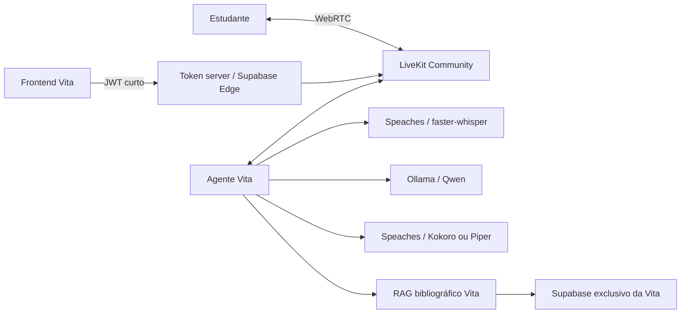

# Aeternum Vita — tutor anatômico de voz auto-hospedado

Pipeline de voz em tempo real sem cobrança por minuto de API. LiveKit Community transporta o áudio; Ollama executa o LLM; Speaches executa STT e TTS; o agente da Aeternum Vita consulta uma base bibliográfica própria antes de responder.

O software é aberto ou executado localmente, mas a infraestrutura continua tendo custo de servidor, GPU, tráfego, armazenamento e operação.

## Arquitetura



O cérebro da Atlas IA não é importado, reconfigurado nem alterado. O único ponto de conhecimento do tutor é `VITA_RAG_URL`, com credencial própria e contrato limitado a consulta. A interface visual da Atlas pode abrir o tutor, mas não compartilha prompts, memória ou tabelas da Atlas IA.

## Componentes

| Componente   | Implementação                     | Função                                                  |
| ------------ | --------------------------------- | ------------------------------------------------------- |
| Transporte   | LiveKit Community `v1.13.5`       | sala, WebRTC, interrupção e mídia                       |
| STT          | Speaches `0.8.3` + faster-whisper | fala para texto em português, espanhol, inglês e alemão |
| LLM          | Ollama `0.32.5` + `qwen3:4b`      | raciocínio conversacional local                         |
| TTS          | Kokoro e Piper via Speaches       | voz de Eduardo, Antonia, Ariana e Fabian                |
| VAD/turno    | LiveKit local Silero + `v1-mini`  | fim de fala sem LiveKit Inference                       |
| Conhecimento | endpoint RAG da Vita              | trechos bibliográficos e referências do turno atual     |

## Inicialização local

Pré-requisitos: Docker Desktop com engine Linux e suporte NVIDIA, Docker Compose atual e aproximadamente 15 GB livres para imagens e modelos.

1. Copie `.env.example` para `.env.local` e troque todos os valores `replace-with-*` por segredos aleatórios.
2. Inicie o Docker Desktop.
3. Na raiz do projeto, execute:

```bash
docker compose --env-file .env.local up --build
```

Na primeira execução, os serviços de inicialização baixam o LLM, o modelo STT e os dois modelos TTS. O cache fica em volumes Docker e não é baixado novamente em cada reinício. Depois, abra `http://localhost:8080`.

Para uma máquina com GPU e VRAM suficientes também para voz:

```bash
docker compose --env-file .env.local -f docker-compose.yml -f docker-compose.speech-gpu.yml up --build
```

Em uma RTX 4050 de 6 GB, o perfil recomendado mantém Ollama na GPU e Speaches na CPU para evitar disputa de VRAM.

## Contrato do RAG da Vita

O agente envia:

```json
{
  "query": "vamos falar sobre a escápula",
  "tutorId": "eduardo",
  "language": "pt",
  "limit": 8
}
```

O endpoint deve responder:

```json
{
  "context": "Trechos bibliográficos recuperados...",
  "sources": [
    { "title": "Livro de anatomia", "page": 72, "reference": "chunk-id" }
  ]
}
```

Sem `VITA_RAG_URL`, o tutor continua funcionando com o conhecimento geral do modelo local, mas não pode ser considerado conectado aos PDFs. O agente nunca transforma uma falha do RAG em uma citação inventada.

## Qualidade

```bash
pnpm install
pnpm test
pnpm typecheck
pnpm build
docker compose --env-file .env.local config
```

Os testes unitários validam seleção de tutor, configuração local, separação do endereço interno/público, política do prompt e contrato RAG. A homologação exige ainda conversa real com microfone, teste de interrupção, latência e acesso externo por TURN.

## Produção

O ambiente local usa `ws://localhost:7880`. Navegadores em produção exigem `wss://`, certificado confiável, IP público e portas de mídia. Consulte `infra/livekit/DEPLOYMENT.md`.

Use a Supabase Edge Function `voice-token` em produção: ela exige usuário autenticado por padrão, limita o nome do agente e devolve somente o `LIVEKIT_PUBLIC_URL`. O token server Express é destinado ao desenvolvimento isolado.

Credenciais que já apareceram em código-fonte devem ser revogadas, mesmo depois de removidas do arquivo. `.env.local`, secret keys Supabase e API secrets LiveKit não podem ser enviados ao Git.
