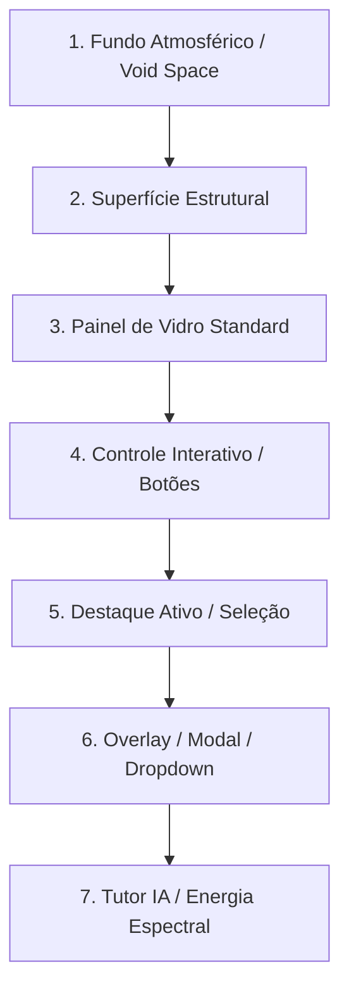

# Aeternum 26.1 Liquid Glass

Aplicar o **Aeternum 26.1** como um sistema de interface completo e arquitetura visual coesa. Não reduzir o conceito a `backdrop-filter`, transparência ou glassmorphism genérico.

---

## 🎯 10 Princípios Norteadores

1. **Hierarquia Clara:** O olhar do usuário é guiado intencionalmente para a informação clínica e pedagógica de maior relevância.
2. **Profundidade Material:** A interface organiza-se em 7 camadas físicas de elevação, transmitindo gravidade e atmosfera.
3. **Refração Sutil:** O vidro simula propriedades ópticas reais (luz ambiente, reflexo nas bordas e micro-brilho superior).
4. **Legibilidade Clínica:** Contraste WCAG AA inegociável; o vidro jamais compete com textos, números ou diagnósticos.
5. **Consistência de Superfícies:** Todos os componentes derivam dos mesmos tokens globais (`--aeternum-glass-*`, `--aeternum-line-*`).
6. **Movimento Funcional:** Transições suaves com curvas de aceleração orgânicas explicando mudanças de estado.
7. **Responsividade Universal:** Matriz de 7 resoluções testadas sem quebra ou scrollbar dupla.
8. **Acessibilidade Inclusiva:** Navegação 100% acessível por teclado, anéis de foco visíveis e suporte a `prefers-reduced-motion`.
9. **Verdade Funcional e Dados Reais:** Proibido uso de interfaces decorativas vazias ou números simulados apresentados como reais.
10. **Estados Honestos da Aplicação:** Comunicação precisa de estados de carregamento, sucesso, erro e conexão.

---

## 🌌 7 Camadas de Profundidade Estrutural



1. **Fundo Atmosférico (`--aeternum-bg-void`):** Escuridão profunda com micro-nebulosas em gradientes escuros.
2. **Superfície Estrutural (`--aeternum-bg-deep`):** Contêineres de base e áreas de agrupamento macro.
3. **Painel de Vidro (`--aeternum-glass-neutral`):** Cards, barras laterais e cabeçalhos translúcidos.
4. **Controle Interativo:** Botões, inputs, chips e seletores com resposta tátil.
5. **Destaque Ativo:** Bordas teal com brilho interior demarcando o foco atual.
6. **Overlay e Modal:** Superfícies elevadas com sombras difusas profundas (`createPortal`).
7. **Tutor IA / Espectral:** Energia multicolorida controlada reservada exclusivamente à inteligência artificial.

---

## 🎨 Paleta e Semiótica das Cores

| Cor / Canal | Token Principal | Função Semiótica |
| :--- | :--- | :--- |
| **Teal Luminoso** | `--aeternum-teal-400` (`#5ce8e2`) | Interação, links, foco, botões primários, progresso e estados sincronizados. |
| **Dourado Nobre** | `--aeternum-gold-400` (`#d9b965`) | Títulos editoriais, indicadores institucionais, prestígio e distinção acadêmica. |
| **Espectro IA** | Multicolorido (Ciano, Violeta, Ouro) | Exclusivo para o **Tutor IA**, processamento generativo e nós de inteligência. |
| **Cinza Clínico** | `--aeternum-text-primary` (`#f4f2ea`) | Textos principais, tipografia de leitura com máximo contraste. |

---

## 🛠️ Regras de Construção Material

### 1. Camada Base do Vidro
```css
background: linear-gradient(
  135deg,
  rgba(96, 190, 188, 0.12),
  rgba(6, 19, 24, 0.34) 42%,
  rgba(4, 12, 16, 0.55)
);
```

### 2. Desfoque Óptico Controlado
```css
backdrop-filter: blur(20px) saturate(135%);
-webkit-backdrop-filter: blur(20px) saturate(135%);
```

### 3. Refração e Luz de Borda
```css
border: 1px solid rgba(126, 222, 218, 0.22);
box-shadow:
  inset 0 1px 0 rgba(255, 255, 255, 0.08),
  inset 0 -1px 0 rgba(54, 180, 176, 0.07),
  0 18px 55px rgba(0, 0, 0, 0.24);
```

---

## 🚫 Anti-Padrões Proibidos (Zero Tolerance)

* ❌ **Proibido Vidro Branco Opaco:** Nada de cards leitosos que pareçam papel sobre fundo escuro.
* ❌ **Proibido Neon Excessivo:** O teal é médico e sereno, nunca estridente estilo cyberpunk.
* ❌ **Proibido Dourado em Botões Comuns:** Dourado é reservado para autoridade e títulos editoriais.
* ❌ **Proibido Espectro Fora da IA:** Não usar gradientes multicoloridos em cards comuns ou menus.
* ❌ **Proibido Tooltips Quebrados:** Não acoplar pseudo-tooltips que cortem dentro de botões ou cards.
* ❌ **Proibido Reposicionar o Token do Tutor IA:** A posição aprovada do Tutor IA é sagrada e congelada.

---

## 📚 Documentos de Referência

Consulte as especificações detalhadas nos arquivos de referência:
- 📖 [Design Tokens & Escalas](references/design-tokens.md)
- 🧩 [Padrões de Componentes & Layouts](references/component-patterns.md)
- ✅ [Checklist de Validação & Auditoria](references/validation-checklist.md)
