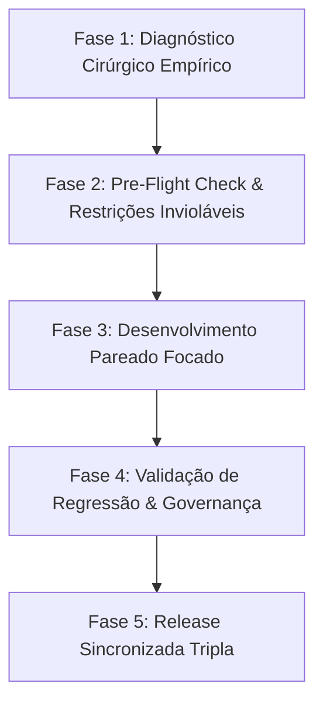

# ⚡ Perfil de Engenharia Eficiente (Método Híbrido Antigravity + Codex)

Esta Skill estabelece o protocolo de engenharia de software de alta precisão para o desenvolvimento no **Aeternum Atlas**. Ela funde a velocidade, o diagnóstico empírico e a transparência do **Antigravity** com a suíte estrita de testes de contrato, governança de design system e esteira de deploy triplo do **Codex**.

---

## 🎯 5 Princípios Fundamentais do Método Híbrido

1. **Velocidade Moderada & Focada (15 a 30 min):** Ciclos de entrega curtos sem entrar em loops repetitivos de compactação de contexto.
2. **Diagnóstico Empírico Transparente:** Leitura direta de logs, tracebacks e código autoritativo. Proibido tentar adivinhar a causa de falhas sem evidência empírica.
3. **Contratos Invioláveis & Zero Regressão:** Respeito absoluto às restrições de UX/UI congeladas pelo usuário (ex: posicionamento de tokens, WCAG AA).
4. **Governança de Design System (Aeternum 26.1):** Uso estrito dos tokens e superfícies da fundação visual sem adição de estilos ad-hoc proibidos (ex: sem `backdrop-filter` direto fora da fundação).
5. **Esteira de Release Sincronizada (Deploy Triplo):** Sincronização automatizada e verificada entre Supabase Edge Functions, GitHub `main` e Vercel Produção.

---

## 📋 Workflow de Execução em 5 Estágios



### 🔍 Estágio 1: Diagnóstico Cirúrgico Empírico (Antigravity Speed)
* Inspecionar rapidamente os arquivos, componentes e tracebacks de erro.
* Nunca induzir hipóteses sem logs concretos ou código autoritativo.
* Manter o consumo de contexto enxuto para evitar perda de memória e loops de re-leitura.

### 🛡️ Estágio 2: Pre-Flight Check & Restrições (Codex Rigor)
* Executar a suíte prévia de testes (`npm run test:contracts`) para estabelecer a linha de base.
* Mapear explicitamente os elementos de interface congelados pelo usuário.
* Verificar se a tarefa impacta Supabase, componentes React, CSS ou Edge Functions.

### ⚡ Estágio 3: Desenvolvimento Pareado Focado (Hybrid Pair-Programming)
* Aplicar edições cirúrgicas e limpas nos arquivos necessários.
* Utilizar padrões de alta resiliência (ex: `createPortal` para modais, fallbacks locais para resiliência).
* Reportar ao usuário o progresso de forma incremental e transparente.

### 🧪 Estágio 4: Validação Estrita de Qualidade & Governança (Codex Quality Bar)
* Executar o build de produção: `npm run build`.
* Checar conformidade contra regras de governança visual e acessibilidade.
* Garantir a aprovação de 100% dos testes de contrato (`npm run test:contracts`).

### 🚀 Estágio 5: Release Sincronizada Tripla (Triple Deploy)
* **Supabase:** Deploy de Edge Functions remotas (se houver alterações no servidor).
* **GitHub:** Commit padronizado e push limpo para a branch `main`.
* **Vercel:** Confirmação do deploy em produção e verificação das URLs públicas oficiais.

---

## 🛠️ Comandos de Validação e Qualidade

```bash
# 1. Executar suíte de contratos de qualidade
npm run test:contracts

# 2. Validar compilação de produção Vite
npm run build

# 3. Deploy de Edge Functions no Supabase (quando aplicável)
supabase functions deploy ai-tutor

# 4. Publicação no repositório GitHub
git add .
git commit -m "feat/fix: <descrição>"
git push origin main
```
