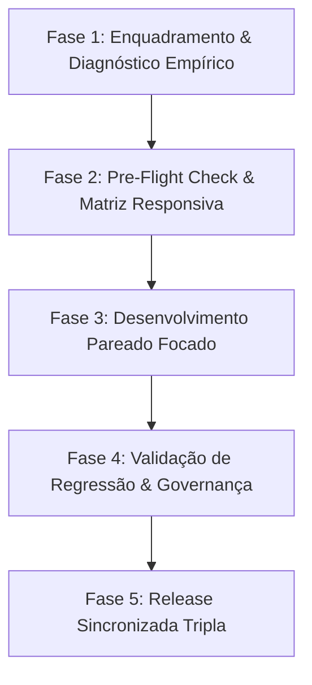

# ⚡ Perfil de Engenharia Eficiente (Método Híbrido Antigravity + Codex)

Esta Skill define o protocolo oficial de engenharia de software para o desenvolvimento no **Aeternum Atlas**. Ela integra a agilidade, transparência e velocidade diagnóstica do **Antigravity** com a governança de design, taxonomia de evidências e esteira de deploy triplo do **Codex**.

---

## 🎯 7 Diretrizes de Ouro do Método Híbrido

1. **Velocidade Moderada & Focada (15 a 30 min):** Ciclos de entrega objetivos sem loops de compactação de contexto.
2. **Verdade Funcional baseada em Evidências:** Uma funcionalidade só é considerada pronta com evidência observável (código, rede, RLS, banco, console e visualização).
3. **Cadeia de Investigação em Profundidade:**
   * *Tutor IA:* `interface → sessão → JWT → Edge Function → contexto → Gemini → resposta → persistência → histórico`
   * *Viewer 3D:* `catálogo → autorização → modelo → provider → Sketchfab → eventos → telemetria → progresso`
4. **Preservação de Trabalho & Estado Git:** Checagem rigorosa de `git status` antes de editar. Proibido sobrepor alterações paralelas ou executar operações destrutivas.
5. **Governança de Design System Aeternum 26.1:** Uso estrito das 7 camadas de Liquid Glass sem CSS ad-hoc proibido (ex: sem `backdrop-filter` direto fora da fundação).
6. **Matriz Responsiva Obrigatória:** Validação contínua nas 4 resoluções chave: Desktop (1920x1080), Notebook (1366x768), Tablet (768x1024) e Mobile (390x844).
7. **Esteira de Release Sincronizada (Deploy Triplo):** Sincronização automatizada entre Supabase Edge Functions, GitHub `main` e Vercel Produção.

---

## 📊 Taxonomia de Evidências e Estados

Toda análise e entrega deve separar honestamente os estados:

### Estados de Diagnóstico:
* **Confirmado:** Comprovado diretamente nesta execução.
* **Relatado:** Presente em descrição sem validação atual.
* **Inferido:** Conclusão técnica plausível aguardando confirmação.
* **Pendente:** Aguardando implementação ou verificação.
* **Bloqueado:** Depende de credencial ou serviço externo.

### Estados de Funcionalidade:
`FUNCIONAL` | `FUNCIONAL_COM_RESTRIÇÕES` | `PARCIAL` | `MOCK` | `SOMENTE_INTERFACE` | `QUEBRADO`

### Níveis de Lançamento (Definition of Done):
`Concluído Localmente` $\rightarrow$ `Concluído no Repositório` $\rightarrow$ `Publicado` $\rightarrow$ `Validado em Produção`

---

## 📋 Workflow de Execução em 5 Estágios



### 🔍 Estágio 1: Enquadramento & Diagnóstico Empírico (Antigravity Speed)
* Identificar objetivo, áreas afetadas, critérios de aceite e riscos.
* Rastrear a causa raiz na cadeia completa de serviços (frontend → backend → Supabase).
* Limitar o consumo de tokens para evitar perda de memória recente.

### 🛡️ Estágio 2: Pre-Flight Check & Matriz Responsiva (Codex Rigor)
* Executar a suíte prévia de testes (`npm run test:contracts`).
* Mapear explicitamente as restrições de UX/UI congeladas pelo usuário (ex: posição do token do Tutor IA).
* Conferir regras de layout para as 4 resoluções obrigatórias (Desktop, Notebook, Tablet, Mobile).

### ⚡ Estágio 3: Desenvolvimento Pareado Focado (Hybrid Pair-Programming)
* Aplicar alterações cirúrgicas reutilizando componentes e tokens Aeternum 26.1.
* Tratar estados de *loading*, *vazio*, *erro* e *sucesso*.
* Manter o usuário informado de forma transparente e contínua.

### 🧪 Estágio 4: Validação Estrita de Qualidade & Governança (Codex Quality Bar)
* Executar o build de produção: `npm run build`.
* Validar que nenhum texto rompe, sobrepõe ou ultrapassa sua superfície.
* Garantir a aprovação de 100% dos testes de contrato (`npm run test:contracts`).

### 🚀 Estágio 5: Release Sincronizada Tripla (Triple Deploy)
* **Supabase:** Deploy de Edge Functions remotas (ex: `supabase functions deploy ai-tutor`).
* **GitHub:** Commit padronizado e push limpo para a branch `main`.
* **Vercel:** Confirmação do deploy no domínio oficial e teste de produção pós-publicação.

---

## 🛠️ Comandos de Qualidade e Publicação

```bash
# 1. Executar suíte de contratos de qualidade
npm run test:contracts

# 2. Validar compilação de produção Vite
npm run build

# 3. Deploy de Edge Functions no Supabase (quando aplicável)
supabase functions deploy ai-tutor

# 4. Publicação no repositório GitHub
git add .
git commit -m "feat/fix: <descrição>"
git push origin main
```
